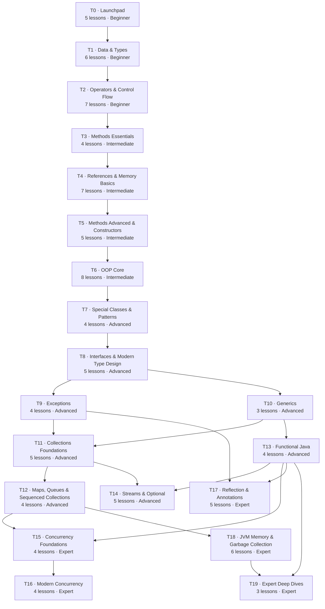

# Curriculum: the Learning DAG (website content structure)

> **Version 3: recalibrated over all notes (batches 1–4) and approved by the user on 2026-09-24**, with the user's
> additions: a **full in-depth Generics & Collections track** and a **Concurrency gap-fill track**.
> This is the **website's content structure** (what learners see). It is independent of the internal work
> **phases** in `PLAN.md`.
>
> **Source of truth:** `project-plan/curriculum.yaml`. The catalogue below is **generated** from it. After editing the
> YAML, run `python3 project-plan/tools/curriculum.py`. It validates the graph (unique ids, no cycles, no dangling
> or later-tier prerequisites, all 305 audit items mapped) and rewrites the catalogue section of this file.
>
> Status keys: `todo` · `drafting` · `review` · `done`. Lesson ids are URL slugs and become **stable once published**.

## How the structure works

- **Nodes = lessons.** Each has a stable `id`, a tier, prerequisites, the source notes it draws on, and the audit
  items (`source-notes/AUDIT.md`) it must address.
- **Edges = prerequisites.** Every page shows "Prerequisites" and "Unlocks next"; the interactive **Roadmap** shows the
  whole graph with the learner's progress and what's unlocked. Prerequisites, not tiers, are the real constraint, so an
  experienced learner can jump ahead (e.g. JVM internals only need Tier 0 + stack/heap).
- **Tiers = level-up.** 20 tiers grouped into 4 levels: **Beginner** (T0–T2), **Intermediate** (T3–T6),
  **Advanced** (T7–T14), **Expert** (T15–T19). Every tier ends with a **Level-up Checkpoint** (quiz + coding challenge
  + mock-interview round); passing it lets a learner "test out" of that tier.
- **Two paths through the same graph:**
  - *Full path*: every lesson in order, from scratch.
  - *Fast-track (experienced developers / senior managers)*: for each lesson read the TL;DR, Myths vs Facts, Senior
    lens and Interview corner first; take the checkpoint; dive into full sections only where the checkpoint shows gaps.

## Scope

**Covered notes (21 note numbers in 18 PDFs):** 01 OOPS · 02 JDK/JRE/JVM · 04 Primitive variables · 06 Non-primitive
variables · 07–08 Methods & constructors · 09 Memory management · 12–13 POJO/Enum/Final/Singleton/Immutable ·
14–15 Interfaces · 16 Functional interfaces & lambdas · 17 Reflection · 18 Annotations · 19 Exceptions ·
20 Operators · 21 Control flow · 28 Streams · 40 Sequenced collections · 41 Sealed classes · Optional.

**Gap-fill lessons** are related topics missing from the notes but needed to understand them (the user asked for
"related topics missing from the notes"). On 2026-09-24 the user chose **full depth** for Generics & Collections and
asked for a **Concurrency** track; the other gap-fills are at essentials depth:

| Gap-fill lesson | Why it's needed |
|---|---|
| `first-program` | Setting up and running Java; probably note #3's topic (not shared) |
| `call-stack` | Stack frames underpin memory, recursion and exception propagation (notes 09, 19) |
| `object-class-contracts` | `equals`/`hashCode`/`toString` are required by collections, records and interviews |
| `nested-and-anonymous-classes` | Used by the singleton holder idiom (12-13), anonymous classes vs lambdas (16), nested interfaces (14-15); probably notes #10/#11 |
| **Tier 10 Generics** (3 lessons, full depth) | Streams, Optional, collections and heap pollution (18) all depend on generics |
| **Tiers 11–12 Collections** (8 lessons + sequenced, full depth) | Streams (28) and sequenced collections (40) build on them; notes #22–27 (Collections Framework series) were referenced but not shared; top interview area (HashMap internals etc.) |
| **Tiers 15–16 Concurrency** (8 lessons, user request) | Referenced by notes 09 (thread stacks), 12-13 (volatile/DCL), 19 (thread death), 28 (Fork-Join); virtual threads & structured concurrency are key modern topics |
| `method-references` | Used throughout the streams and Optional notes |
| `try-with-resources` | The modern way to do what note 19 does with `finally` |
| `records-and-pattern-matching` | The payoff of sealed classes (41) and modern switch (21) |
| `memory-leaks-and-diagnostics`, `object-memory-layout`, `numbers-in-production` | Senior-level "production" angle on notes 04, 06, 09 |

**Out of scope** (no notes shared; they appear only as "just enough" callouts where another lesson needs them):
I/O & NIO, networking/HTTP client, JDBC (only as an example in `optional`), modules/JPMS (only `--add-opens` in
reflection), design patterns beyond singleton/factory, testing frameworks, build tools, Spring. Earlier lessons that
touch concurrency (`singleton-pattern`, `parallel-streams`) keep a short callout and link forward to Tiers 15–16.

## Catalogue

<!-- BEGIN GENERATED CATALOGUE -->
_Generated from `curriculum.yaml` by `tools/curriculum.py`. Don't edit this section by hand._

**98 lessons** in **20 tiers** (+ 20 Level-up Checkpoints). 305 audit items mapped. Lessons that are pure gap-fill: 12. Source notes used: 01, 02, 04, 06, 07, 08, 09, 12-13, 14-15, 16, 17, 18, 19, 20, 21, 28, 40, 41, Optional.

### Tier overview (transitive reduction of tier dependencies)

### Tier 0 — Launchpad (Beginner)

| # | ID | Lesson | Prerequisites | Unlocks | Sources | Audit items | Status |
|---|---|---|---|---|---|---|---|
| 0.1 | `java-landscape` | **Java in 2026**: Java in 2026: platform, releases, LTS, distributions, SE vs Jakarta EE | – | `jdk-jre-jvm`, `oop-mindset` | 02, gap | 2.1, 2.10, 2.11 | done |
| 0.2 | `jdk-jre-jvm` | **JDK, JRE & JVM**: JDK, JRE, JVM: what each contains, jlink, the JDK tool map | `java-landscape` | `first-program` | 02 | 2.2, 2.3, 2.5, 2.7, 2.8, 2.9 | done |
| 0.3 | `first-program` | **Your First Program**: Your first program: setup, javac/java, source launcher, jshell, compact source files & instance main | `jdk-jre-jvm` | `how-java-runs`, `variables-basics` | gap | 2.11 | done |
| 0.4 | `how-java-runs` | **How Java Runs**: How Java runs: bytecode, class loading, interpreter + tiered JIT, first look at javap | `first-program` | `call-stack`, `jvm-architecture` | 02 | 2.4, 2.6 | done |
| 0.5 | `oop-mindset` | **The OOP Mindset**: The OOP mindset: procedural vs OOP, objects (state, behaviour, identity), classes as blueprints | `java-landscape` | `variable-kinds` | 01 | 1.1, 1.2, 1.3, 1.4, 1.5, 1.6, 1.7 | done |
| 0.✓ | `checkpoint-0` | **Level-up Checkpoint 0**: quiz + coding challenge + mock interview round | all tier 0 | – | – | – | done |

### Tier 1 — Data & Types (Beginner)

| # | ID | Lesson | Prerequisites | Unlocks | Sources | Audit items | Status |
|---|---|---|---|---|---|---|---|
| 1.1 | `variables-basics` | **Variables & Typing**: Variables, identifiers, keywords, static & strong typing, var | `first-program` | `integer-types`, `variable-kinds` | 04 | 4.1, 4.2, 4.3, 4.4, 4.5 | done |
| 1.2 | `integer-types` | **Integer Types**: byte/short/int/long: two's complement, literals, overflow, unsigned helpers | `variables-basics` | `char-and-boolean`, `floating-point`, `type-conversion`, `bitwise-and-shift-operators` | 04 | 4.7, 4.8, 4.9, 4.10, 4.22 | done |
| 1.3 | `char-and-boolean` | **char & boolean**: char as UTF-16 code unit (Unicode, surrogate pairs) and boolean | `integer-types` | `type-conversion` | 04 | 4.6, 4.11 | done |
| 1.4 | `floating-point` | **Floating Point (IEEE 754)**: Floating point in depth: IEEE 754 float/double, rounding, special values, BigDecimal intro | `integer-types` | `type-conversion`, `numbers-in-production` | 04 | 4.18, 4.19, 4.20, 4.21 | done |
| 1.5 | `type-conversion` | **Type Conversion & Casting**: Type conversion: widening, narrowing, numeric promotion, constant expressions, casting | `integer-types`, `char-and-boolean`, `floating-point` | `operators-arithmetic-relational-logical`, `wrappers-boxing` | 04 | 4.12, 4.13, 4.14, 4.15 | done |
| 1.6 | `variable-kinds` | **Kinds of Variables**: Kinds of variables: local, instance, static, parameters; scope, lifetime, defaults, definite assignment | `variables-basics`, `oop-mindset` | `methods-basics`, `static-vs-instance`, `final-and-constants` | 04 | 4.16, 4.17 | done |
| 1.✓ | `checkpoint-1` | **Level-up Checkpoint 1**: quiz + coding challenge + mock interview round | all tier 1 | – | – | – | done |

### Tier 2 — Operators & Control Flow (Beginner)

| # | ID | Lesson | Prerequisites | Unlocks | Sources | Audit items | Status |
|---|---|---|---|---|---|---|---|
| 2.1 | `operators-arithmetic-relational-logical` | **Arithmetic, Relational & Logical Operators**: Arithmetic, relational & logical operators: integer division, modulo, short-circuiting, string + | `type-conversion` | `operators-unary-assignment`, `conditionals`, `strings`, `numbers-in-production` | 20 | 20.1, 20.2, 20.3, 20.4, 20.5 | done |
| 2.2 | `operators-unary-assignment` | **Unary & Assignment Operators**: Unary & assignment operators: prefix/postfix traps, compound assignment's hidden cast | `operators-arithmetic-relational-logical` | `bitwise-and-shift-operators`, `ternary-instanceof-precedence` | 20 | 20.6, 20.7 | done |
| 2.3 | `bitwise-and-shift-operators` | **Bitwise & Shift Operators**: Bitwise & shift operators: masks, ~n = -(n+1), >> vs >>>, promotion & shift-distance masking | `operators-unary-assignment`, `integer-types` | `hashmap-internals` | 20 | 20.8, 20.9, 20.10, 20.11, 20.12 | done |
| 2.4 | `ternary-instanceof-precedence` | **Ternary, instanceof & Precedence**: Ternary typing traps, instanceof (+ patterns), precedence vs evaluation order | `operators-unary-assignment` | `records-and-pattern-matching` | 20 | 20.13, 20.14, 20.15, 20.16, 20.17 | done |
| 2.5 | `conditionals` | **Conditionals**: if, if-else, else-if ladder, nested if, guard clauses | `operators-arithmetic-relational-logical` | `switch-statements-and-expressions`, `loops-and-branching` | 21 | 21.1, 21.2 | done |
| 2.6 | `switch-statements-and-expressions` | **switch Statements & Expressions**: switch: fall-through, rules, arrow labels, switch expressions & yield, exhaustiveness | `conditionals` | `enums`, `records-and-pattern-matching` | 21 | 21.3, 21.4, 21.5, 21.6, 21.7, 21.8, 21.9, 21.10, 21.11 | done |
| 2.7 | `loops-and-branching` | **Loops & Branching**: for, while, do-while, for-each, break/continue/labels, loop pitfalls | `conditionals` | `methods-basics`, `arrays`, `collections-framework-overview` | 21 | 21.12, 21.13, 21.14, 21.15 | done |
| 2.✓ | `checkpoint-2` | **Level-up Checkpoint 2**: quiz + coding challenge + mock interview round | all tier 2 | – | – | – | done |

### Tier 3 — Methods Essentials (Intermediate)

| # | ID | Lesson | Prerequisites | Unlocks | Sources | Audit items | Status |
|---|---|---|---|---|---|---|---|
| 3.1 | `methods-basics` | **Methods**: Methods: anatomy, signature, parameters vs arguments, return, types of methods | `variable-kinds`, `loops-and-branching` | `call-stack`, `packages-access-modifiers`, `static-vs-instance`, `overloading-resolution`, `constructors-basics` | 07 | 7.1, 7.2, 7.4, 7.5, 7.6, 7.7 | done |
| 3.2 | `call-stack` | **The Call Stack**: The call stack: frames, locals, recursion, StackOverflowError | `methods-basics`, `how-java-runs` | `stack-heap-references`, `exceptions-basics`, `threads-basics` | 09, gap | 9.2, 9.5, 9.6, 9.7 | done |
| 3.3 | `packages-access-modifiers` | **Packages & Access Modifiers**: Packages & access modifiers: visibility matrix, the protected subtlety, nest-mates | `methods-basics` | `private-constructors-static-factories`, `encapsulation` | 07 | 7.3 | done |
| 3.4 | `static-vs-instance` | **static vs Instance**: static vs instance members, method hiding, when to use static | `methods-basics`, `variable-kinds` | `final-and-constants`, `constructor-chaining-init-order`, `nested-and-anonymous-classes`, `jvm-memory-areas` | 07, 04 | 7.10, 7.11, 4.17 | done |
| 3.✓ | `checkpoint-3` | **Level-up Checkpoint 3**: quiz + coding challenge + mock interview round | all tier 3 | – | – | – | done |

### Tier 4 — References & Memory Basics (Intermediate)

| # | ID | Lesson | Prerequisites | Unlocks | Sources | Audit items | Status |
|---|---|---|---|---|---|---|---|
| 4.1 | `stack-heap-references` | **Stack, Heap & References**: Stack vs heap, references, new, null, reachability (worked memory walkthrough) | `call-stack` | `pass-by-value`, `reference-types`, `constructors-basics`, `jvm-architecture` | 06, 09 | 6.2, 6.4, 6.11, 9.1, 9.3, 9.4, 9.8, 9.11, 9.12 | todo |
| 4.2 | `pass-by-value` | **Pass-by-Value**: Java is always pass-by-value: primitives vs references, mutation vs reassignment | `stack-heap-references` | – | 06, gap | 6.3, 6.4, 6.10 | todo |
| 4.3 | `reference-types` | **Reference Types**: Reference types: class, interface, array, enum, record; parent references to child objects | `stack-heap-references` | `strings`, `arrays`, `wrappers-boxing`, `final-and-constants`, `classes-objects-deep` | 06 | 6.1, 6.7 | todo |
| 4.4 | `strings` | **Strings**: Strings: immutability, String Constant Pool, == vs equals, intern, StringBuilder, text blocks | `reference-types`, `operators-arithmetic-relational-logical` | `object-class-contracts`, `jvm-memory-areas` | 06 | 6.5, 6.6 | todo |
| 4.5 | `arrays` | **Arrays**: Arrays: objects on the heap, initialisation, multi-dimensional, covariance, Arrays utilities | `reference-types`, `loops-and-branching` | `varargs`, `list-implementations` | 06 | 6.8 | todo |
| 4.6 | `wrappers-boxing` | **Wrappers & Autoboxing**: Wrapper classes & autoboxing: Integer cache, NPE on unboxing, costs | `reference-types`, `type-conversion` | `overloading-resolution`, `generics-basics`, `object-memory-layout`, `numbers-in-production` | 06, 12-13 | 6.9, 6.10, 6.11, 6.12, 12.30 | todo |
| 4.7 | `final-and-constants` | **final & Constants**: final variables & constants: compile-time constants, inlining, final is not immutable | `variable-kinds`, `static-vs-instance`, `reference-types` | `encapsulation`, `immutable-and-final-classes` | 06 | 6.13 | todo |
| 4.✓ | `checkpoint-4` | **Level-up Checkpoint 4**: quiz + coding challenge + mock interview round | all tier 4 | – | – | – | todo |

### Tier 5 — Methods Advanced & Constructors (Intermediate)

| # | ID | Lesson | Prerequisites | Unlocks | Sources | Audit items | Status |
|---|---|---|---|---|---|---|---|
| 5.1 | `overloading-resolution` | **Overloading**: Overloading & overload resolution: widening, boxing, varargs phases, ambiguity | `methods-basics`, `wrappers-boxing` | `varargs`, `polymorphism` | 07 | 7.8 | todo |
| 5.2 | `varargs` | **Varargs**: Varargs: it's an array, rules, overload interplay, heap-pollution preview | `overloading-resolution`, `arrays` | `generics-erasure-and-limitations` | 07 | 7.14 | todo |
| 5.3 | `constructors-basics` | **Constructors**: Constructors: rules and whys (the <init> truth), default vs no-arg vs parameterised vs copy | `stack-heap-references`, `methods-basics` | `constructor-chaining-init-order`, `classes-objects-deep` | 08 | 8.1, 8.2, 8.3, 8.4, 8.5, 8.6 | todo |
| 5.4 | `constructor-chaining-init-order` | **Constructor Chaining & Init Order**: this()/super() chaining, flexible constructor bodies (Java 25), initialisation order | `constructors-basics`, `static-vs-instance` | `private-constructors-static-factories`, `inheritance`, `bytecode-and-dispatch` | 08 | 8.8, 8.9, 8.10 | todo |
| 5.5 | `private-constructors-static-factories` | **Private Constructors & Static Factories**: Private constructors: utility classes, static factory methods vs GoF Factory Method | `constructor-chaining-init-order`, `packages-access-modifiers` | `enums`, `singleton-pattern` | 08, 07 | 8.7, 7.11 | todo |
| 5.✓ | `checkpoint-5` | **Level-up Checkpoint 5**: quiz + coding challenge + mock interview round | all tier 5 | – | – | – | todo |

### Tier 6 — OOP Core (Intermediate)

| # | ID | Lesson | Prerequisites | Unlocks | Sources | Audit items | Status |
|---|---|---|---|---|---|---|---|
| 6.1 | `classes-objects-deep` | **Classes & Objects in Depth**: Classes & objects in depth: state/behaviour/identity, this, object lifecycle | `constructors-basics`, `reference-types` | `object-class-contracts`, `encapsulation`, `inheritance`, `enums`, `reflection-basics` | 01 | 1.1, 1.5, 1.6, 1.7 | todo |
| 6.2 | `object-class-contracts` | **The Object Class Contracts**: java.lang.Object: equals/hashCode/toString contracts, getClass, clone, finalize (deprecated) | `classes-objects-deep`, `strings` | `pojo-javabean-dto-records`, `collections-framework-overview` | gap, 01 | 1.22 | todo |
| 6.3 | `encapsulation` | **Encapsulation**: Encapsulation vs data hiding: invariants, getters/setters done right, defensive copies | `classes-objects-deep`, `packages-access-modifiers`, `final-and-constants` | `pojo-javabean-dto-records`, `immutable-and-final-classes` | 01 | 1.11, 1.12, 1.13 | todo |
| 6.4 | `inheritance` | **Inheritance**: Inheritance: extends, types (incl. hybrid), what is/isn't inherited, super, final classes | `classes-objects-deep`, `constructor-chaining-init-order` | `polymorphism`, `relationships`, `nested-and-anonymous-classes`, `immutable-and-final-classes`, `exceptions-basics` | 01 | 1.14, 1.15, 1.16 | todo |
| 6.5 | `polymorphism` | **Polymorphism**: Polymorphism: overriding rules, dynamic dispatch, up/downcasting, method hiding | `inheritance`, `overloading-resolution` | `abstract-classes`, `custom-exceptions-and-best-practices`, `generics-bounds-and-wildcards`, `bytecode-and-dispatch` | 01, 07 | 1.17, 1.18, 1.19, 7.9, 7.12 | todo |
| 6.6 | `abstract-classes` | **Abstract Classes**: Abstraction & abstract classes: abstract methods, constructors in abstract classes | `polymorphism` | `interfaces-in-depth` | 01, 07, 08 | 1.8, 1.9, 1.10, 7.13, 8.4 | todo |
| 6.7 | `relationships` | **IS-A, HAS-A & Composition**: IS-A vs HAS-A: association, aggregation, composition; composition over inheritance | `inheritance` | – | 01 | 1.20, 1.21 | todo |
| 6.8 | `nested-and-anonymous-classes` | **Nested & Anonymous Classes**: Nested classes: static nested, inner, local, anonymous (and when to use each) | `inheritance`, `static-vs-instance` | `singleton-pattern`, `comparable-and-comparator`, `functional-interfaces` | gap, 06, 12-13, 14-15 | 6.7, 12.24, 14.12 | todo |
| 6.✓ | `checkpoint-6` | **Level-up Checkpoint 6**: quiz + coding challenge + mock interview round | all tier 6 | – | – | – | todo |

### Tier 7 — Special Classes & Patterns (Advanced)

| # | ID | Lesson | Prerequisites | Unlocks | Sources | Audit items | Status |
|---|---|---|---|---|---|---|---|
| 7.1 | `pojo-javabean-dto-records` | **POJO, JavaBean, DTO & Records**: POJO vs JavaBean vs DTO vs Entity vs Value Object vs record | `encapsulation`, `object-class-contracts` | `records-and-pattern-matching` | 12-13 | 12.1, 12.2, 12.3 | todo |
| 7.2 | `enums` | **Enums in Depth**: Enums in depth: values/valueOf/ordinal/name, fields & constructors, constant bodies, EnumSet/EnumMap | `classes-objects-deep`, `private-constructors-static-factories`, `switch-statements-and-expressions` | `singleton-pattern`, `set-implementations` | 12-13, 04 | 12.4, 12.5, 12.6, 12.7, 12.8, 12.9, 12.10, 12.11, 12.12, 12.13, 12.14, 4.5 | todo |
| 7.3 | `immutable-and-final-classes` | **Immutable & Final Classes**: Final classes & immutable classes: rules, defensive copies, shallow vs deep immutability | `encapsulation`, `inheritance`, `final-and-constants` | `sealed-classes`, `java-memory-model` | 12-13 | 12.15, 12.27, 12.28, 12.29 | todo |
| 7.4 | `singleton-pattern` | **The Singleton Pattern**: Singleton: 6 variants, DCL + volatile (JMM basics), breaking & protecting singletons, DI view | `private-constructors-static-factories`, `nested-and-anonymous-classes`, `enums` | `java-memory-model`, `reflection-in-practice` | 12-13 | 12.16, 12.17, 12.18, 12.19, 12.20, 12.21, 12.22, 12.23, 12.24, 12.25, 12.26 | todo |
| 7.✓ | `checkpoint-7` | **Level-up Checkpoint 7**: quiz + coding challenge + mock interview round | all tier 7 | – | – | – | todo |

### Tier 8 — Interfaces & Modern Type Design (Advanced)

| # | ID | Lesson | Prerequisites | Unlocks | Sources | Audit items | Status |
|---|---|---|---|---|---|---|---|
| 8.1 | `interfaces-in-depth` | **Interfaces in Depth**: Interfaces in depth: declaration, fields, methods, implementation rules, nested interfaces | `abstract-classes` | `interface-evolution-default-static-private`, `sealed-classes`, `try-with-resources`, `generics-basics`, `reflection-basics` | 14-15 | 14.1, 14.2, 14.3, 14.4, 14.6, 14.7, 14.8, 14.9, 14.10, 14.11, 14.12, 14.19 | todo |
| 8.2 | `interface-evolution-default-static-private` | **Default, Static & Private Methods**: Default, static & private interface methods; diamond resolution; extending interfaces | `interfaces-in-depth` | `abstract-class-vs-interface`, `sequenced-collections`, `functional-interfaces` | 14-15, 01 | 14.14, 14.15, 14.16, 14.17, 14.18, 1.15 | todo |
| 8.3 | `abstract-class-vs-interface` | **Abstract Class vs Interface**: Abstract class vs interface: the decision guide | `interface-evolution-default-static-private` | – | 14-15 | 14.5, 14.13 | todo |
| 8.4 | `sealed-classes` | **Sealed Classes**: Sealed classes & interfaces (Java 17): permits, final/sealed/non-sealed, rules | `interfaces-in-depth`, `immutable-and-final-classes` | `records-and-pattern-matching` | 41 | 41.1, 41.2, 41.3, 41.4, 41.5, 41.6 | todo |
| 8.5 | `records-and-pattern-matching` | **Records & Pattern Matching**: Records, record patterns & pattern matching for switch: data-oriented programming | `sealed-classes`, `pojo-javabean-dto-records`, `switch-statements-and-expressions`, `ternary-instanceof-precedence` | `reflection-in-practice` | 41, 21, gap | 41.7, 1.22, 4.22, 21.9 | todo |
| 8.✓ | `checkpoint-8` | **Level-up Checkpoint 8**: quiz + coding challenge + mock interview round | all tier 8 | – | – | – | todo |

### Tier 9 — Exceptions (Advanced)

| # | ID | Lesson | Prerequisites | Unlocks | Sources | Audit items | Status |
|---|---|---|---|---|---|---|---|
| 9.1 | `exceptions-basics` | **Exceptions Basics**: Exceptions: propagation through the call stack, hierarchy, checked vs unchecked, reading stack traces | `call-stack`, `inheritance` | `exception-handling-mechanics`, `iterators-and-fail-fast`, `optional`, `numbers-in-production` | 19 | 19.1, 19.2, 19.3, 19.4, 19.5, 19.6, 19.7 | todo |
| 9.2 | `exception-handling-mechanics` | **Handling Exceptions**: try/catch/finally, multi-catch, throw/throws, chaining, finally gotchas | `exceptions-basics` | `try-with-resources`, `threads-basics`, `reflection-basics` | 19 | 19.8, 19.10, 19.11, 19.12, 19.13, 19.14, 19.15 | todo |
| 9.3 | `try-with-resources` | **try-with-resources**: try-with-resources: AutoCloseable, close order, suppressed exceptions | `exception-handling-mechanics`, `interfaces-in-depth` | `custom-exceptions-and-best-practices` | 19, gap | 19.9, 19.20 | todo |
| 9.4 | `custom-exceptions-and-best-practices` | **Custom Exceptions & Best Practices**: Custom exceptions & best practices: design, translation, cost, anti-patterns (senior lens) | `try-with-resources`, `polymorphism` | `completablefuture` | 19 | 19.16, 19.17, 19.18, 19.19 | todo |
| 9.✓ | `checkpoint-9` | **Level-up Checkpoint 9**: quiz + coding challenge + mock interview round | all tier 9 | – | – | – | todo |

### Tier 10 — Generics (Advanced)

| # | ID | Lesson | Prerequisites | Unlocks | Sources | Audit items | Status |
|---|---|---|---|---|---|---|---|
| 10.1 | `generics-basics` | **Generics Basics**: Generics basics: generic classes, interfaces & methods, type inference, diamond, raw types | `interfaces-in-depth`, `wrappers-boxing` | `generics-bounds-and-wildcards`, `collections-framework-overview`, `lambda-expressions` | gap | – | todo |
| 10.2 | `generics-bounds-and-wildcards` | **Bounds & Wildcards**: Bounded types & wildcards: extends/super, PECS, recursive bounds (T extends Comparable<T>) | `generics-basics`, `polymorphism` | `generics-erasure-and-limitations`, `comparable-and-comparator` | gap | – | todo |
| 10.3 | `generics-erasure-and-limitations` | **Type Erasure & Limitations**: Type erasure: bridge methods, reifiable types, no generic arrays, heap pollution & @SafeVarargs | `generics-bounds-and-wildcards`, `varargs` | `annotations-builtin` | gap, 18 | 18.8, 18.9 | todo |
| 10.✓ | `checkpoint-10` | **Level-up Checkpoint 10**: quiz + coding challenge + mock interview round | all tier 10 | – | – | – | todo |

### Tier 11 — Collections Foundations (Advanced)

| # | ID | Lesson | Prerequisites | Unlocks | Sources | Audit items | Status |
|---|---|---|---|---|---|---|---|
| 11.1 | `collections-framework-overview` | **Collections Framework Overview**: Collections Framework overview: hierarchy, choosing a collection, Big-O table, immutable collections, Collections utilities | `generics-basics`, `object-class-contracts`, `loops-and-branching` | `iterators-and-fail-fast`, `comparable-and-comparator`, `streams-fundamentals` | gap, 40 | 40.11 | todo |
| 11.2 | `iterators-and-fail-fast` | **Iterators & Fail-Fast**: Iterable, Iterator & ListIterator: fail-fast vs fail-safe, ConcurrentModificationException, removeIf | `collections-framework-overview`, `exceptions-basics` | `list-implementations`, `set-implementations` | gap, 21 | 21.12 | todo |
| 11.3 | `comparable-and-comparator` | **Comparable & Comparator**: Comparable & Comparator: natural ordering, comparator combinators, consistency with equals | `collections-framework-overview`, `generics-bounds-and-wildcards`, `nested-and-anonymous-classes` | `set-implementations`, `map-implementations`, `queues-and-deques` | gap, 28 | 28.6 | todo |
| 11.4 | `list-implementations` | **Lists in Depth**: Lists in depth: ArrayList internals (growth, amortised cost), LinkedList, Vector/Stack legacy, List API | `iterators-and-fail-fast`, `arrays` | `queues-and-deques`, `sequenced-collections` | gap | – | todo |
| 11.5 | `set-implementations` | **Sets in Depth**: Sets in depth: HashSet, LinkedHashSet, TreeSet/NavigableSet, EnumSet; equality & ordering rules | `iterators-and-fail-fast`, `comparable-and-comparator`, `enums` | `hashmap-internals`, `sequenced-collections` | gap | – | todo |
| 11.✓ | `checkpoint-11` | **Level-up Checkpoint 11**: quiz + coding challenge + mock interview round | all tier 11 | – | – | – | todo |

### Tier 12 — Maps, Queues & Sequenced Collections (Advanced)

| # | ID | Lesson | Prerequisites | Unlocks | Sources | Audit items | Status |
|---|---|---|---|---|---|---|---|
| 12.1 | `hashmap-internals` | **HashMap Internals**: HashMap internals: hashing, buckets, load factor, resize, treeification, equals/hashCode consequences | `set-implementations`, `bitwise-and-shift-operators` | `map-implementations`, `atomics-and-concurrent-collections` | gap | – | todo |
| 12.2 | `map-implementations` | **Maps in Depth**: Maps in depth: LinkedHashMap (LRU), TreeMap/NavigableMap, EnumMap, IdentityHashMap, Hashtable legacy, modern Map API | `hashmap-internals`, `comparable-and-comparator` | `sequenced-collections`, `java-reference-types` | gap | – | todo |
| 12.3 | `queues-and-deques` | **Queues & Deques**: Queues & deques: Queue/Deque API, ArrayDeque, PriorityQueue (binary heap), stacks done right | `list-implementations`, `comparable-and-comparator` | `sequenced-collections`, `atomics-and-concurrent-collections` | gap, 40 | 40.4 | todo |
| 12.4 | `sequenced-collections` | **Sequenced Collections**: Sequenced collections (Java 21): SequencedCollection/Set/Map, reversed views | `list-implementations`, `set-implementations`, `map-implementations`, `queues-and-deques`, `interface-evolution-default-static-private` | – | 40 | 40.1, 40.2, 40.3, 40.4, 40.5, 40.6, 40.7, 40.8, 40.9, 40.10 | todo |
| 12.✓ | `checkpoint-12` | **Level-up Checkpoint 12**: quiz + coding challenge + mock interview round | all tier 12 | – | – | – | todo |

### Tier 13 — Functional Java (Advanced)

| # | ID | Lesson | Prerequisites | Unlocks | Sources | Audit items | Status |
|---|---|---|---|---|---|---|---|
| 13.1 | `functional-interfaces` | **Functional Interfaces**: Functional interfaces: SAM rule, @FunctionalInterface, Object methods, inheritance cases | `interface-evolution-default-static-private`, `nested-and-anonymous-classes` | `lambda-expressions`, `annotations-builtin` | 16, 18 | 16.1, 16.2, 16.3, 16.7, 18.7 | todo |
| 13.2 | `lambda-expressions` | **Lambda Expressions**: Lambda expressions: syntax, target typing, effectively final capture, this, invokedynamic | `functional-interfaces`, `generics-basics` | `built-in-functional-interfaces`, `threads-basics`, `bytecode-and-dispatch` | 16 | 16.4, 16.5, 16.8 | todo |
| 13.3 | `built-in-functional-interfaces` | **Built-in Functional Interfaces**: java.util.function: Consumer, Supplier, Function, Predicate, Bi*, primitive specialisations, composition | `lambda-expressions` | `method-references`, `executors-and-thread-pools` | 16 | 16.6 | todo |
| 13.4 | `method-references` | **Method References**: Method references: the 4 kinds and when they're clearer than lambdas | `built-in-functional-interfaces` | `streams-fundamentals`, `completablefuture` | gap | – | todo |
| 13.✓ | `checkpoint-13` | **Level-up Checkpoint 13**: quiz + coding challenge + mock interview round | all tier 13 | – | – | – | todo |

### Tier 14 — Streams & Optional (Advanced)

| # | ID | Lesson | Prerequisites | Unlocks | Sources | Audit items | Status |
|---|---|---|---|---|---|---|---|
| 14.1 | `streams-fundamentals` | **Streams Fundamentals**: Streams fundamentals: pipeline, creation, laziness, vertical processing, single use | `method-references`, `collections-framework-overview` | `stream-operations` | 28 | 28.1, 28.2, 28.3, 28.4, 28.9, 28.10, 28.13 | todo |
| 14.2 | `stream-operations` | **Stream Operations**: Intermediate & terminal operations: catalogue, comparators, reduce, match/find | `streams-fundamentals` | `collectors-and-advanced-streams`, `parallel-streams`, `optional` | 28 | 28.5, 28.6, 28.7, 28.8, 28.11, 28.12 | todo |
| 14.3 | `collectors-and-advanced-streams` | **Collectors & Advanced Streams**: Collectors & advanced streams: groupingBy, partitioningBy, toMap, teeing, takeWhile, gatherers | `stream-operations` | – | 28, gap | 28.16 | todo |
| 14.4 | `parallel-streams` | **Parallel Streams**: Parallel streams: spliterator, Fork-Join, when they help, pitfalls, measuring with JMH | `stream-operations` | – | 28 | 28.14, 28.15 | todo |
| 14.5 | `optional` | **Optional**: Optional: API, orElse vs orElseGet, map/flatMap, where (not) to use it | `stream-operations`, `exceptions-basics` | – | Optional | O.1, O.2, O.3, O.4, O.5, O.6, O.7, O.8, O.9, O.10 | todo |
| 14.✓ | `checkpoint-14` | **Level-up Checkpoint 14**: quiz + coding challenge + mock interview round | all tier 14 | – | – | – | todo |

### Tier 15 — Concurrency Foundations (Expert)

| # | ID | Lesson | Prerequisites | Unlocks | Sources | Audit items | Status |
|---|---|---|---|---|---|---|---|
| 15.1 | `threads-basics` | **Threads**: Threads: creating & starting, lifecycle states, join/sleep/interrupt, daemon threads, uncaught exceptions | `lambda-expressions`, `exception-handling-mechanics`, `call-stack` | `synchronization-and-locks` | gap, 09, 19 | 9.5, 19.3 | todo |
| 15.2 | `synchronization-and-locks` | **Synchronization & Locks**: Race conditions & synchronization: synchronized, intrinsic locks, wait/notify, deadlock, ReentrantLock, ReadWriteLock | `threads-basics` | `java-memory-model` | gap | – | todo |
| 15.3 | `java-memory-model` | **The Java Memory Model**: Java Memory Model: visibility, happens-before, volatile, atomicity, safe publication, final fields (DCL explained) | `synchronization-and-locks`, `singleton-pattern`, `immutable-and-final-classes` | `atomics-and-concurrent-collections`, `virtual-threads-and-structured-concurrency` | gap, 12-13 | 12.22 | todo |
| 15.4 | `atomics-and-concurrent-collections` | **Atomics & Concurrent Collections**: Atomics & concurrent collections: CAS, AtomicInteger/LongAdder, ConcurrentHashMap, CopyOnWriteArrayList, BlockingQueue | `java-memory-model`, `hashmap-internals`, `queues-and-deques` | `synchronizers`, `executors-and-thread-pools` | gap | – | todo |
| 15.✓ | `checkpoint-15` | **Level-up Checkpoint 15**: quiz + coding challenge + mock interview round | all tier 15 | – | – | – | todo |

### Tier 16 — Modern Concurrency (Expert)

| # | ID | Lesson | Prerequisites | Unlocks | Sources | Audit items | Status |
|---|---|---|---|---|---|---|---|
| 16.1 | `synchronizers` | **Synchronizers**: Synchronizers: CountDownLatch, CyclicBarrier, Semaphore, Phaser; producer-consumer patterns | `atomics-and-concurrent-collections` | – | gap | – | todo |
| 16.2 | `executors-and-thread-pools` | **Executors & Thread Pools**: Executors & thread pools: Callable/Future, ThreadPoolExecutor tuning, rejection, shutdown, ForkJoinPool & work stealing | `atomics-and-concurrent-collections`, `built-in-functional-interfaces` | `completablefuture`, `virtual-threads-and-structured-concurrency` | gap, 28 | 28.14 | todo |
| 16.3 | `completablefuture` | **CompletableFuture**: CompletableFuture: async pipelines, thenApply/thenCompose/allOf, error handling, custom executors, timeouts | `executors-and-thread-pools`, `method-references`, `custom-exceptions-and-best-practices` | – | gap | – | todo |
| 16.4 | `virtual-threads-and-structured-concurrency` | **Virtual Threads & Structured Concurrency**: Virtual threads (Java 21), pinning, ThreadLocal vs scoped values (Java 25), structured concurrency (preview) | `executors-and-thread-pools`, `java-memory-model` | – | gap, 09 | 9.5 | todo |
| 16.✓ | `checkpoint-16` | **Level-up Checkpoint 16**: quiz + coding challenge + mock interview round | all tier 16 | – | – | – | todo |

### Tier 17 — Reflection & Annotations (Expert)

| # | ID | Lesson | Prerequisites | Unlocks | Sources | Audit items | Status |
|---|---|---|---|---|---|---|---|
| 17.1 | `reflection-basics` | **Reflection Basics**: Reflection basics: Class objects, inspecting classes, methods, fields, constructors | `classes-objects-deep`, `interfaces-in-depth`, `exception-handling-mechanics` | `reflection-in-practice`, `annotations-builtin` | 17 | 17.1, 17.2, 17.3, 17.4, 17.5 | todo |
| 17.2 | `reflection-in-practice` | **Reflection in Practice**: Reflection in practice: invoke, private access, strong encapsulation, proxies, method handles | `reflection-basics`, `singleton-pattern`, `records-and-pattern-matching` | `custom-annotations` | 17 | 17.6, 17.7, 17.8, 17.9, 17.10, 17.11 | todo |
| 17.3 | `annotations-builtin` | **Built-in Annotations**: Built-in annotations: @Override, @Deprecated, @SuppressWarnings, @FunctionalInterface, @SafeVarargs | `reflection-basics`, `functional-interfaces`, `generics-erasure-and-limitations` | `meta-annotations` | 18 | 18.1, 18.2, 18.3, 18.4, 18.5, 18.6, 18.7, 18.8, 18.9 | todo |
| 17.4 | `meta-annotations` | **Meta-Annotations**: Meta-annotations: @Target, @Retention, @Documented, @Inherited, @Repeatable | `annotations-builtin` | `custom-annotations` | 18 | 18.10, 18.11, 18.12, 18.13, 18.14 | todo |
| 17.5 | `custom-annotations` | **Custom Annotations**: Custom annotations + runtime processing (mini validation framework), annotation processors intro | `meta-annotations`, `reflection-in-practice` | – | 18 | 18.15 | todo |
| 17.✓ | `checkpoint-17` | **Level-up Checkpoint 17**: quiz + coding challenge + mock interview round | all tier 17 | – | – | – | todo |

### Tier 18 — JVM Memory & Garbage Collection (Expert)

| # | ID | Lesson | Prerequisites | Unlocks | Sources | Audit items | Status |
|---|---|---|---|---|---|---|---|
| 18.1 | `jvm-architecture` | **JVM Architecture**: JVM architecture: class loaders, runtime data areas, execution engine, AOT cache | `how-java-runs`, `stack-heap-references` | `jvm-memory-areas`, `bytecode-and-dispatch` | 02, 09 | 2.3, 2.4, 2.6, 9.1 | todo |
| 18.2 | `jvm-memory-areas` | **JVM Memory Areas**: JVM memory areas: heap generations/regions, Metaspace vs PermGen, where statics & strings live | `jvm-architecture`, `static-vs-instance`, `strings` | `garbage-collection-basics`, `object-memory-layout` | 09 | 9.19, 9.20, 9.25, 9.26 | todo |
| 18.3 | `garbage-collection-basics` | **Garbage Collection**: Garbage collection: GC roots, reachability, mark-sweep-compact, copying, generations, minor/major GC | `jvm-memory-areas` | `gc-collectors`, `java-reference-types` | 09 | 9.9, 9.13, 9.14, 9.18, 9.21, 9.22, 9.23, 9.24, 9.27 | todo |
| 18.4 | `gc-collectors` | **Garbage Collectors**: Garbage collectors: Serial, Parallel, G1, ZGC, Shenandoah (CMS history), choosing by SLA | `garbage-collection-basics` | `memory-leaks-and-diagnostics` | 09 | 9.10, 9.28, 9.29, 9.30, 9.31, 9.32, 9.33 | todo |
| 18.5 | `java-reference-types` | **Soft, Weak & Phantom References**: Strong, soft, weak & phantom references, ReferenceQueue, Cleaner, WeakHashMap | `garbage-collection-basics`, `map-implementations` | `memory-leaks-and-diagnostics` | 09 | 9.4, 9.15, 9.16, 9.17 | todo |
| 18.6 | `memory-leaks-and-diagnostics` | **Memory Leaks & Diagnostics**: Memory leaks & diagnostics: leak patterns, OOM types, heap sizing, GC logs, jcmd/JFR/heap dumps | `gc-collectors`, `java-reference-types` | – | 09, gap | 9.34 | todo |
| 18.✓ | `checkpoint-18` | **Level-up Checkpoint 18**: quiz + coding challenge + mock interview round | all tier 18 | – | – | – | todo |

### Tier 19 — Expert Deep Dives (Expert)

| # | ID | Lesson | Prerequisites | Unlocks | Sources | Audit items | Status |
|---|---|---|---|---|---|---|---|
| 19.1 | `object-memory-layout` | **Object Memory Layout**: Object memory layout: headers, compressed oops, compact object headers, measuring with JOL | `jvm-memory-areas`, `wrappers-boxing` | – | 06, gap | 6.2, 6.12 | todo |
| 19.2 | `bytecode-and-dispatch` | **Bytecode & Dispatch**: Bytecode & dispatch: javap, <init>/<clinit>, invoke* instructions, vtables, lambdas via indy | `jvm-architecture`, `polymorphism`, `constructor-chaining-init-order`, `lambda-expressions` | – | 08, 01 | 8.2, 1.18 | todo |
| 19.3 | `numbers-in-production` | **Numbers in Production**: Numbers in production: overflow-safe math, money with BigDecimal, float comparisons, boxing costs | `floating-point`, `operators-arithmetic-relational-logical`, `wrappers-boxing`, `exceptions-basics` | – | 04, 06, 20 | 4.14, 4.21, 6.12, 20.3 | todo |
| 19.✓ | `checkpoint-19` | **Level-up Checkpoint 19**: quiz + coding challenge + mock interview round | all tier 19 | – | – | – | todo |

### Build order (topological)

`java-landscape` → `jdk-jre-jvm` → `first-program` → `how-java-runs` → `oop-mindset` → `variables-basics` → `integer-types` → `char-and-boolean` → `floating-point` → `type-conversion` → `variable-kinds` → `operators-arithmetic-relational-logical` → `operators-unary-assignment` → `bitwise-and-shift-operators` → `ternary-instanceof-precedence` → `conditionals` → `switch-statements-and-expressions` → `loops-and-branching` → `methods-basics` → `call-stack` → `packages-access-modifiers` → `static-vs-instance` → `stack-heap-references` → `pass-by-value` → `reference-types` → `strings` → `arrays` → `wrappers-boxing` → `final-and-constants` → `overloading-resolution` → `varargs` → `constructors-basics` → `constructor-chaining-init-order` → `private-constructors-static-factories` → `classes-objects-deep` → `object-class-contracts` → `encapsulation` → `inheritance` → `polymorphism` → `abstract-classes` → `relationships` → `nested-and-anonymous-classes` → `pojo-javabean-dto-records` → `enums` → `immutable-and-final-classes` → `singleton-pattern` → `interfaces-in-depth` → `interface-evolution-default-static-private` → `abstract-class-vs-interface` → `sealed-classes` → `records-and-pattern-matching` → `exceptions-basics` → `exception-handling-mechanics` → `try-with-resources` → `custom-exceptions-and-best-practices` → `generics-basics` → `generics-bounds-and-wildcards` → `generics-erasure-and-limitations` → `collections-framework-overview` → `iterators-and-fail-fast` → `comparable-and-comparator` → `list-implementations` → `set-implementations` → `hashmap-internals` → `map-implementations` → `queues-and-deques` → `sequenced-collections` → `functional-interfaces` → `lambda-expressions` → `built-in-functional-interfaces` → `method-references` → `streams-fundamentals` → `stream-operations` → `collectors-and-advanced-streams` → `parallel-streams` → `optional` → `threads-basics` → `synchronization-and-locks` → `java-memory-model` → `atomics-and-concurrent-collections` → `synchronizers` → `executors-and-thread-pools` → `completablefuture` → `virtual-threads-and-structured-concurrency` → `reflection-basics` → `reflection-in-practice` → `annotations-builtin` → `meta-annotations` → `custom-annotations` → `jvm-architecture` → `jvm-memory-areas` → `garbage-collection-basics` → `gc-collectors` → `java-reference-types` → `memory-leaks-and-diagnostics` → `object-memory-layout` → `bytecode-and-dispatch` → `numbers-in-production`

<!-- END GENERATED CATALOGUE -->

## Cross-cutting site sections (hubs)

| Section | Contents |
|---|---|
| **Roadmap** | Interactive DAG of all 98 lessons, coloured by tier/level, with per-browser progress and "what can I unlock next". |
| **Interview Prep hub** | Every interview question from all lessons (target ≥ 1,000), filterable by topic / level (Fresher → Mid → Senior → Staff/Manager) / type (concept, code, predict-output, design, behavioural-technical); rapid-fire revision; timed mock-interview sets; "how to answer" frameworks for senior roles. |
| **Practice hub** | Index of all exercises (each with starter code, the tests it must pass and a reference solution), predict-the-output bank, debugging challenges, and multi-tier **mini-projects**: (1) money ledger with BigDecimal + exceptions, (2) library system in OOP, (3) expression evaluator with sealed records + pattern matching, (4) employee analytics with streams & collectors, (5) mini validation/DI framework with reflection & annotations, (6) memory-leak hunt lab with heap dumps, (7) LRU cache (LinkedHashMap + hand-rolled), (8) concurrent web-crawler / job runner with executors → virtual threads. |
| **Cheat sheets** | One-screen summary per lesson and per tier (print-friendly). |
| **Glossary** | Every term with a one-line definition and a link to its lesson. |
| **Java versions timeline** | What changed per release (8 → 27) for the covered topics, with LTS markers and preview status. |
| **Notes audit** | Human-readable version of `source-notes/AUDIT.md` ("Myth vs Fact" index). |

## Recalibration log

- **v1 (2026-09-24, batch 1):** 39 lessons / 7 tiers over notes 01, 02, 04, 06, 07-08.
- **v2 (2026-09-24, all batches):** 81 lessons / 16 tiers. Added operators & control flow (Tier 2), exceptions
  (Tier 9), generics & collections essentials + sequenced collections (Tier 10), functional Java (Tier 11), streams &
  Optional (Tier 12), reflection & annotations (Tier 13), JVM memory & GC (Tier 14). Split the old
  `abstraction-interfaces` and `modern-oop-records-sealed-patterns` nodes; `private-constructors-singleton` became
  `private-constructors-static-factories` + `singleton-pattern`. No lesson had been published, so no URLs changed.
- **v3 (2026-09-24, approved):** 98 lessons / 20 tiers. User chose full in-depth Generics (T10, 3 lessons) and
  Collections (T11–T12, 8 lessons + sequenced), replacing `generics-essentials`/`collections-essentials`, and asked
  for Concurrency (T15–T16, 8 lessons). Functional/Streams/Reflection/JVM/Expert tiers renumbered to T13/14/17/18/19.

## Extending the DAG (when new notes arrive)

1. Save the PDF to `source-notes/pdf/`, extract text or transcribe, and audit it in `source-notes/AUDIT.md`.
2. Add or adjust lessons in `curriculum.yaml` (new ids; never rename published ids), map every new audit item.
3. Run `python3 project-plan/tools/curriculum.py` (must print `OK`), then add a content phase in `PLAN.md`.
