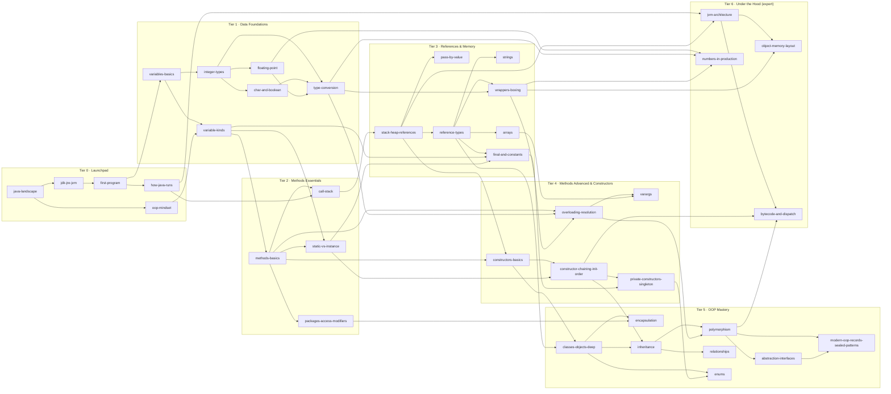

# Curriculum: the Learning DAG (website content structure)

> This is the **website's content structure** (what learners see). It is independent of the internal work
> **phases** in `PLAN.md`. Scope = only the topics in the 5 notes received so far, plus closely related
> topics that are missing from them. New notes → new nodes get added to this graph (see "Extending the DAG").
>
> Status keys: `todo` · `drafting` · `review` · `done`

## How the structure works

- **Nodes = lessons.** Each lesson has a stable `id` (slug). IDs never change once published (URLs depend on them).
- **Edges = prerequisites.** A lesson lists what you should know first; the site shows "Prerequisites" and
  "Unlocks next" on every page and an interactive **Roadmap** graph with your progress.
- **Tiers = levels.** Tiers group lessons by depth ("level up"). Each tier ends with a **Level-up Checkpoint**
  (quiz + coding challenge + mock interview round). Senior learners can "test out" of a tier by passing its checkpoint.
- **Two paths through the same graph:**
  - *Full path*: every node in order (from scratch).
  - *Fast-track (experienced devs / senior managers)*: each lesson's TL;DR + Myths + Senior lens + Interview corner
    first, then the checkpoint, with deep sections only where the checkpoint shows gaps.

## Node catalogue

Source-note keys: `01` OOPS · `02` JDK/JRE/JVM · `04` Primitive · `06` Non-primitive · `07-08` Methods & Constructors ·
`gap` = related topic missing from the notes. Audit IDs refer to `source-notes/AUDIT.md`.

### Tier 0 — Launchpad (platform & setup)

| ID | Lesson | Prereqs | Source | Audit items | Status |
|---|---|---|---|---|---|
| `java-landscape` | Java in 2026: what it is, where it runs, release cadence & LTS (8/11/17/21/25 → 29), OpenJDK vs vendor builds, licensing basics, SE vs Jakarta EE vs ME, Android ≠ Java ME | – | 02, gap | 2.1, 2.10, 2.11 | todo |
| `jdk-jre-jvm` | JDK, JRE, JVM: what each contains, the modern "no separate JRE" + `jlink` story, JDK tool map, platform dependence vs bytecode independence | java-landscape | 02 | 2.2–2.9 | todo |
| `first-program` | Setup (JDK 25, IDE, SDKMAN), `javac`/`java`, single- & multi-file source launch, `jshell`, compact source files & instance `main` (JEP 512), anatomy of `public static void main(String[] args)` | jdk-jre-jvm | gap (likely note #3) | 2.11 | todo |
| `how-java-runs` | Source → bytecode → class loading → linking/verification → interpreter + tiered JIT (C1/C2) → CPU; first look at `javap` | first-program | 02 | 2.4, 2.6 | todo |
| `oop-mindset` | Procedural vs OOP; objects (state, behaviour, identity) and classes as blueprints, concept-level | java-landscape | 01 (p1–3) | 1.1–1.7 | todo |
| **Checkpoint 0** | Level-up: platform & setup | all T0 | | | todo |

### Tier 1 — Data Foundations

| ID | Lesson | Prereqs | Source | Audit items | Status |
|---|---|---|---|---|---|
| `variables-basics` | Variables, declaration/initialisation, identifiers & naming rules, keywords (reserved, contextual, `_`), static vs strong typing, `var`, literal overview | first-program | 04 | 4.1–4.5 | todo |
| `integer-types` | `byte/short/int/long`: sizes, ranges, two's complement (interactive), integer literals (bin/hex/octal/`_`/`L`), overflow & wrap-around, unsigned helpers | variables-basics | 04 | 4.7–4.10, 4.22 | todo |
| `char-and-boolean` | `char` as UTF-16 code unit, Unicode, surrogate pairs, char arithmetic; `boolean` (size, defaults) | integer-types | 04 | 4.6, 4.11 | todo |
| `floating-point` | IEEE 754 deep dive (interactive bit visualiser): float/double layout, bias, worked examples 4.125 & 0.7, rounding, special values, precision, `0.1+0.2`, BigDecimal intro | integer-types | 04 | 4.18–4.21 | todo |
| `type-conversion` | Widening (incl. precision loss), narrowing (bit truncation, double→int saturation), numeric promotion, constant-expression exception, compound assignment, casting matrix | integer-types, char-and-boolean, floating-point | 04 | 4.12–4.15 | todo |
| `variable-kinds` | Local, instance, static, parameters: scope, lifetime, storage, default values vs **definite assignment**, shadowing | variables-basics, oop-mindset | 04 | 4.16, 4.17 | todo |
| **Checkpoint 1** | Level-up: data & types | all T1 | | | todo |

### Tier 2 — Methods Essentials

| ID | Lesson | Prereqs | Source | Audit items | Status |
|---|---|---|---|---|---|
| `methods-basics` | Why methods; declaration anatomy; **signature**; parameters vs arguments; return; naming; types of methods overview (library/user-defined/static/instance/abstract/final…) | variable-kinds | 07 | 7.1, 7.2, 7.4–7.7 | todo |
| `call-stack` | Method call stack & frames (animated diagram), local variables in frames, recursion basics, `StackOverflowError` | methods-basics, how-java-runs | gap | – | todo |
| `packages-access-modifiers` | Packages & imports 101; `public/protected/package-private/private` for classes, fields, methods, constructors; visibility matrix; the `protected` subtlety; nest-mates | methods-basics | 07 | 7.3 | todo |
| `static-vs-instance` | Static vs instance members (methods, fields, blocks); method hiding; when to make something static; static factory vs GoF Factory Method | methods-basics, variable-kinds | 07, 04 | 7.10, 7.11, 4.17 | todo |
| **Checkpoint 2** | Level-up: methods essentials | all T2 | | | todo |

### Tier 3 — References & Memory

| ID | Lesson | Prereqs | Source | Audit items | Status |
|---|---|---|---|---|---|
| `stack-heap-references` | Stack vs heap, what a reference is (and isn't), `new`, `null`, object reachability & GC intro, escape analysis teaser | call-stack | 06 | 6.2, 6.4, 6.11 | todo |
| `pass-by-value` | Java is always pass-by-value: primitives vs references, mutation vs re-assignment, the `swap` experiment, memory diagrams | stack-heap-references | 06, gap | 6.3, 6.4, 6.10 | todo |
| `reference-types` | Kinds of reference types (class, interface, array, enum, record, type variable); parent/interface references to child objects; anonymous-class doubt | stack-heap-references | 06 | 6.1, 6.7 | todo |
| `strings` | Immutability & why, String Constant Pool, `==` vs `equals`, `intern`, compile-time vs runtime concatenation, StringBuilder/Buffer, text blocks, compact strings, essential modern APIs | reference-types | 06 | 6.5, 6.6 | todo |
| `arrays` | Arrays as objects, declaration & initialisation forms, defaults, memory layout, multi-dimensional & jagged, covariance & `ArrayStoreException`, `Arrays` utilities | reference-types | 06 | 6.8 | todo |
| `wrappers-boxing` | Wrapper classes, autoboxing/unboxing, Integer cache & `==` trap, NPE on unboxing, performance, `valueOf`/`parseX`, Valhalla outlook | reference-types, type-conversion | 06 | 6.9–6.12 | todo |
| `final-and-constants` | `final` locals/fields/params, `static final` constants, compile-time constants & inlining, final ≠ immutable, immutability patterns | variable-kinds, reference-types, static-vs-instance | 06 | 6.13 | todo |
| **Checkpoint 3** | Level-up: references & memory | all T3 | | | todo |

### Tier 4 — Methods Advanced & Constructors

| ID | Lesson | Prereqs | Source | Audit items | Status |
|---|---|---|---|---|---|
| `overloading-resolution` | Overloading rules and the 3-phase resolution (widening → boxing → varargs), most-specific method, ambiguity (`null`, boxing), overloading vs overriding preview | methods-basics, type-conversion, wrappers-boxing | 07, 01 | 7.8 | todo |
| `varargs` | Varargs mechanics (it's an array), rules, overload interplay, `@SafeVarargs` & heap pollution | overloading-resolution, arrays | 07 | 7.14 | todo |
| `constructors-basics` | What/why; rules; why no return type (the `<init>` truth); why not static/final/abstract/synchronized; default vs no-arg vs parameterised vs copy constructors; the "disappearing default constructor" | stack-heap-references, methods-basics | 08 | 8.1–8.6 | todo |
| `constructor-chaining-init-order` | `this(...)`/`super(...)`, **Flexible Constructor Bodies (Java 25)**, instance/static initializer blocks, full object initialisation order, overridable calls in constructors, `this`-escape | constructors-basics, static-vs-instance | 08 | 8.8–8.10 | todo |
| `private-constructors-singleton` | Private constructors: utility classes, static factories, non-subclassable classes; Singleton variants & trade-offs (eager, lazy, holder, DCL+volatile, enum) | constructor-chaining-init-order, final-and-constants | 08 | 8.7 | todo |
| **Checkpoint 4** | Level-up: methods & constructors | all T4 | | | todo |

### Tier 5 — OOP Mastery

| ID | Lesson | Prereqs | Source | Audit items | Status |
|---|---|---|---|---|---|
| `classes-objects-deep` | Classes & objects in depth: state/behaviour/identity, `this`, object lifecycle, `java.lang.Object` & the `equals`/`hashCode`/`toString` contracts | constructors-basics, reference-types | 01 | 1.1, 1.5–1.7, 1.22 | todo |
| `encapsulation` | Encapsulation vs data hiding, invariants, getters/setters done right, defensive copies, immutability, records as encapsulated carriers | classes-objects-deep, packages-access-modifiers | 01 | 1.11–1.13 | todo |
| `inheritance` | `extends`, types (single, multilevel, hierarchical, multiple, hybrid), what is and isn't inherited, `super`, constructors in hierarchies, `final` classes | classes-objects-deep, constructor-chaining-init-order | 01 | 1.14–1.16 | todo |
| `polymorphism` | Compile-time vs runtime; overriding rules (covariant returns, access, exceptions, `@Override`); dynamic dispatch; up/downcasting; `instanceof` patterns; method hiding | inheritance, overloading-resolution | 01, 07 | 1.17–1.19, 7.9 | todo |
| `abstraction-interfaces` | Abstraction; abstract classes vs interfaces (Java 8 `default`/`static`, Java 9 `private`), diamond resolution rules, functional interfaces teaser, choosing between them | polymorphism | 01 | 1.8–1.10, 1.15, 7.13 | todo |
| `relationships` | IS-A vs HAS-A; association, aggregation, composition (code + UML); composition over inheritance | inheritance | 01 | 1.20, 1.21 | todo |
| `modern-oop-records-sealed-patterns` | Records, sealed classes/interfaces, pattern matching for `switch` & record patterns, data-oriented programming; primitive patterns (preview) | polymorphism, abstraction-interfaces | gap | 1.22, 4.22 | todo |
| `enums` | Enums as full classes: fields, constructors (implicitly private), methods, constant-specific bodies, `EnumSet`/`EnumMap` teaser, enum singleton | classes-objects-deep, private-constructors-singleton | 04 (type tree), gap | 4.5, 8.6 | todo |
| **Checkpoint 5** | Level-up: OOP mastery | all T5 | | | todo |

### Tier 6 — Under the Hood (expert)

| ID | Lesson | Prereqs | Source | Audit items | Status |
|---|---|---|---|---|---|
| `jvm-architecture` | Class-loader subsystem (bootstrap/platform/app, delegation), runtime data areas (heap, stacks, Metaspace, PC, native), execution engine (interpreter, C1/C2, deopt), GC overview (G1 default everywhere in JDK 27), AOT cache (Project Leyden) | how-java-runs, stack-heap-references | 02 | 2.3, 2.4, 2.6 | todo |
| `object-memory-layout` | Object headers, compressed oops, alignment/padding, **compact object headers** (default in JDK 27), measuring with JOL, the real cost of boxing & wrappers | jvm-architecture, wrappers-boxing | 06, gap | 6.2, 6.12 | todo |
| `bytecode-and-dispatch` | Reading `javap -c`: `<init>`/`<clinit>`, `invokestatic/special/virtual/interface/dynamic`; overloading = compile-time selection, overriding = runtime dispatch; vtables/itables; string concat via `invokedynamic` | jvm-architecture, polymorphism, constructor-chaining-init-order | 07-08, 01 | 8.2, 1.18 | todo |
| `numbers-in-production` | Overflow-safe arithmetic (`Math.*Exact`), money with BigDecimal (scale, `RoundingMode`, `compareTo`), floating comparisons, parsing/formatting & locales, boxing costs in hot paths | floating-point, type-conversion, wrappers-boxing | 04, 06 | 4.14, 4.21, 6.12 | todo |
| **Checkpoint 6** | Level-up: expert | all T6 | | | todo |

**Totals:** 39 lessons + 7 checkpoints.

## Cross-cutting site sections (hubs)

| Section | Contents |
|---|---|
| **Roadmap** | Interactive DAG of all nodes, coloured by tier, with per-browser progress, "what can I unlock next". |
| **Interview Prep hub** | Every interview question from all lessons, filterable by topic / difficulty (Fresher → Mid → Senior → Staff/Manager) / type (concept, code, predict-output, design, behavioural-technical); rapid-fire revision; timed mock interview sets; "how to answer" frameworks for senior roles. |
| **Practice hub** | Index of all exercises (with tests in `java-track/practice`), predict-the-output bank, debugging challenges, mini-projects that combine tiers. |
| **Cheat sheets** | One-screen summaries per lesson and per tier (printable). |
| **Glossary** | Every term with a one-line definition + link to the lesson. |
| **Java versions timeline** | What changed per release (8 → 27) for the topics covered, with LTS markers. |
| **Notes audit** | Human-readable version of `source-notes/AUDIT.md`. |

## Out of scope for now (waiting for your future notes)

Operators & control flow as standalone lessons (they appear only as needed inside examples), exceptions,
generics, collections, lambdas/streams, concurrency & virtual threads, I/O & NIO, JDBC, modules (JPMS),
design patterns / SOLID / LLD, testing, build tools, Spring. Topics here get promoted into the DAG when the
related notes arrive.

## Extending the DAG (when new notes arrive)

1. Save PDF to `source-notes/pdf/NN_Name.pdf`, extract text, write transcript.
2. Add an audit section to `source-notes/AUDIT.md`.
3. Add nodes here (new stable IDs, prereq edges, tier) and to `website/curriculum` (the site's data source).
4. Author lessons with the template, then update hubs, run QA and deploy (see `PLAN.md` → "Future notes intake").
