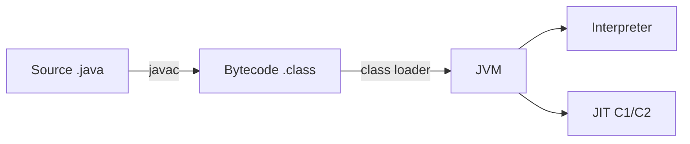

import Callout from '../../../components/Callout.astro';
import MythVsFact from '../../../components/MythVsFact.astro';
import VersionBadge from '../../../components/VersionBadge.astro';
import JavaExample from '../../../components/JavaExample.astro';
import CompileResult from '../../../components/CompileResult.astro';
import PredictOutput from '../../../components/PredictOutput.astro';
import Exercise from '../../../components/Exercise.astro';
import InterviewQ from '../../../components/InterviewQ.astro';
import InterviewSet from '../../../components/InterviewSet.astro';
import Quiz from '../../../components/Quiz.astro';
import Flashcards from '../../../components/Flashcards.astro';
import MemoryDiagram from '../../../components/MemoryDiagram.astro';
import BitLayout from '../../../components/BitLayout.astro';
import Stepper from '../../../components/Stepper.astro';
import Step from '../../../components/Step.astro';
import Terminal from '../../../components/Terminal.astro';
import FaqItem from '../../../components/FaqItem.astro';
import CheatSheet from '../../../components/CheatSheet.astro';
import LayerDiagram from '../../../components/LayerDiagram.astro';
import { Tabs, TabItem } from '@astrojs/starlight/components';

## Callouts

<Callout type="tldr">
- `char` is a 16-bit **UTF-16 code unit**, not an ASCII character.
- A `boolean` field defaults to `false`.
</Callout>

<Callout type="senior">In code review, flag `new BigDecimal(0.1)`: it captures the binary rounding error. Use `BigDecimal.valueOf(0.1)` or `new BigDecimal("0.1")`.</Callout>

<Callout type="pitfall">`Integer` values from −128 to 127 are cached, so `==` "works" for small numbers only.</Callout>

<Callout type="doubt" title="Is Java pass-by-reference for objects?">No. Java copies the **reference** (pass-by-value); a method can change the object but never the caller's variable.</Callout>

<Callout type="deep-dive">Constructors compile to a method named `<init>` with a `void` descriptor.</Callout>

<Callout type="version">Flexible constructor bodies are final in Java 25 <VersionBadge since={25} jep={513} />.</Callout>

## Myth vs Fact

<MythVsFact myth="The default value of a boolean field is true." audit="4.11">
Fields of type `boolean` default to **`false`**. Local variables have no default at all: using one before assigning it is a compile error.
</MythVsFact>

## Version badges

<VersionBadge since={21} /> <VersionBadge preview={27} jep={532} /> <VersionBadge incubator={27} jep={537} /> <VersionBadge deprecated={9} /> <VersionBadge removed={14} />

## Code from java-track

<JavaExample file="examples/src/main/java/track/template/HelloTrack.java" snippet="greeting" output />

<JavaExample file="examples/src/main/java/track/template/HelloTrack.java" title="Whole file" mark={[7, 8]} />

## Compile results

<Tabs>
<TabItem label="Interface (no return type)">
<CompileResult case="template/missing-return-type" />
</TabItem>
<TabItem label="Class (no return type)">
<CompileResult case="template/missing-return-type-in-class" />
</TabItem>
<TabItem label="Looks like a constructor">
<CompileResult case="template/constructor-looking-method" />
</TabItem>
</Tabs>

## Predict the output

<PredictOutput file="examples/src/main/java/track/template/HelloTrack.java" snippet="greeting">
String concatenation with `+` builds a new `String`; `println` adds the line break.
</PredictOutput>

## Exercise

<Exercise id="template/DigitSum" difficulty="warmup" title="Sum of digits" hints={["Use % 10 to get the last digit and / 10 to drop it.", "Math.abs(Integer.MIN_VALUE) is still negative: widen to long first."]}>
Implement `DigitSum.sumOfDigits(int n)`: return the sum of the decimal digits of `n`, ignoring the sign.
</Exercise>

## Interview questions

<InterviewQ level="mid" q="Why is `String` immutable?" followUps={["How does that relate to the String Constant Pool?"]} redFlags={["'For performance' with no mechanism"]} tests="Understanding of security, pooling, caching and thread-safety.">
Immutability makes strings safe to share: the pool can reuse literals, the `hashCode` can be cached, strings can be
passed between threads and used as map keys, and security-sensitive values (class names, file paths) can't change after
validation.
</InterviewQ>

<InterviewSet lesson="template" />

## Quiz

<Quiz lesson="template" />

## Flashcards

<Flashcards lesson="template" />

## Memory diagram

<MemoryDiagram
	caption="Two variables share one pooled literal; `new String` makes a separate heap object"
	frames={[{ name: 'main()', vars: [{ name: 's1', type: 'String', ref: 'lit' }, { name: 's2', type: 'String', ref: 'lit' }, { name: 's3', type: 'String', ref: 'obj', highlight: true }, { name: 'n', type: 'int', value: '10' }] }]}
	heap={[{ id: 'obj', label: 'String (new)', fields: [{ name: 'value', ref: 'bytes' }] }, { id: 'bytes', label: 'byte[] "hello"' }, { id: 'lit', label: '"hello"', pool: true }]}
/>

## Bits

<BitLayout groups={[{ bits: '0', label: 'sign' }, { bits: '10000001', label: 'exponent = 129 (2 + 127)' }, { bits: '00001000000000000000000', label: 'mantissa' }]} caption="4.125f as IEEE 754 single precision" />

<BitLayout groups={[{ bits: '1011', label: '-8 + 0 + 2 + 1 = -5' }]} weights signed caption="~4 in 4-bit two's complement" />

## Stepper

<Stepper title="What happens to the stack when a method returns">
<Step title="1. main() calls greet()">
<MemoryDiagram frames={[{ name: 'greet()', vars: [{ name: 'msg', type: 'String', ref: 'm' }], highlight: true }, { name: 'main()', vars: [{ name: 'x', type: 'int', value: '1' }] }]} heap={[{ id: 'm', label: '"hi"', pool: true }]} />
</Step>
<Step title="2. greet() returns: its frame is popped">
<MemoryDiagram frames={[{ name: 'greet()', vars: [{ name: 'msg', type: 'String', ref: 'm' }], gone: true }, { name: 'main()', vars: [{ name: 'x', type: 'int', value: '1' }] }]} heap={[{ id: 'm', label: '"hi"', pool: true }]} />
</Step>
</Stepper>

## Math

The float value is $(-1)^{s} \times (1 + m) \times 2^{e - 127}$:

$$
4.125 = (-1)^0 \times 1.03125 \times 2^{129 - 127}
$$

## Mermaid

## Terminal

<Terminal command="java -cp classes track.template.HelloTrack" outputFile="examples/src/test/resources/outputs/track/template/HelloTrack.txt" />

<Terminal session={`$ java --version
openjdk 25.0.4.1 2026-08-18
$ echo done
done`} capturedOn="JDK 25.0.4.1 (Ubuntu, x64)" />

## Layer diagram

<LayerDiagram caption="Outer layers contain inner ones" layers={[{ title: 'Outer', note: 'note', items: ['`a`', 'b'] }, { title: 'Middle', items: ['c'] }, { title: 'Inner' }]} />

## FAQ item

<FaqItem q="Is `char` a character?">It's a UTF-16 **code unit**.</FaqItem>

## Cheat sheet

<CheatSheet>

| Term | Meaning |
|---|---|
| `int` | 32-bit signed |

</CheatSheet>
