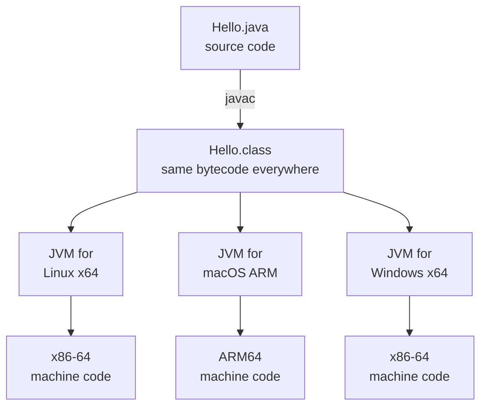
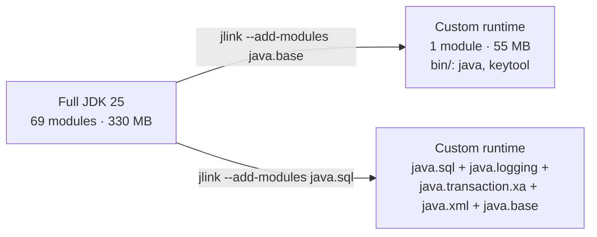

import { Tabs, TabItem, FileTree } from '@astrojs/starlight/components';
import Callout from '../../../components/Callout.astro';
import MythVsFact from '../../../components/MythVsFact.astro';
import VersionBadge from '../../../components/VersionBadge.astro';
import JavaExample from '../../../components/JavaExample.astro';
import PredictOutput from '../../../components/PredictOutput.astro';
import Exercise from '../../../components/Exercise.astro';
import InterviewSet from '../../../components/InterviewSet.astro';
import Quiz from '../../../components/Quiz.astro';
import Flashcards from '../../../components/Flashcards.astro';
import Terminal from '../../../components/Terminal.astro';
import FaqItem from '../../../components/FaqItem.astro';
import CheatSheet from '../../../components/CheatSheet.astro';
import LayerDiagram from '../../../components/LayerDiagram.astro';

## Why this matters

A team builds a service on a laptop with the newest JDK. On the server it dies at start-up with
`UnsupportedClassVersionError`. Another team's container image is 400 MB because it ships a whole JDK, compiler
included, to production. Both problems have the same cause: not knowing what the JDK, the runtime and the JVM each
contain. This lesson fixes that, with every claim checked on a real JDK 25.

## TL;DR

<Callout type="tldr">
- The **JVM** (Java Virtual Machine) runs **bytecode**, the contents of `.class` files. "JVM" is a specification with
  real implementations; the most common one is **HotSpot**.
- The **Java runtime**, historically called the **JRE**, is the JVM plus the **class libraries** (the Java SE modules,
  starting with `java.base`). It can run programs but has no compiler.
- The **JDK** is the runtime plus about 30 **development tools**: `javac`, `jar`, `jshell`, `jlink`, `javap`, `jcmd`, `jfr`…
- **Bytecode is platform independent; the JVM, the runtime and the JDK are not.** You install the build for your OS and CPU.
- **Since JDK 11 there is no separate JRE** from Oracle or OpenJDK. Use a JDK, a vendor's JRE build, or build your
  own runtime with **`jlink`** (JDK 9+).
- Bytecode is **forward-compatible only**: a newer JVM runs older class files, never the reverse. `javac --release N`
  targets an older Java.
</Callout>

## Mental model

Think of a **song file and music players**.

- **Bytecode** is the song file. One file plays on every device.
- The **JVM** is the player app. There is a different build of the app for Windows, macOS and Linux, but each one plays
  the same file.
- The **runtime (JRE)** is the player plus the libraries it needs to play every format.
- The **JDK** is a recording studio: it has a player, plus the tools to *create* songs (the compiler) and to inspect,
  package and debug them.

Where the analogy breaks: a music player just plays. The JVM also watches which parts of your program run most often and
compiles them into fast machine code while the program runs.

<LayerDiagram
	caption="Each layer contains the one inside it. Since JDK 11 the middle layer is no longer a separate download."
	layers={[
		{ title: 'JDK: Java Development Kit', note: 'what developers install', items: ['`javac`', '`jar`', '`javadoc`', '`jshell`', '`jlink`', '`jpackage`', '`javap`', '`jdeps`', '`jcmd`', '`jfr`', '`jdb`', '… ~30 tools'] },
		{ title: 'Java runtime, historically the JRE', note: 'what an application needs to run', items: ['Class libraries = Java SE modules:', '`java.base`', '`java.sql`', '`java.net.http`', '`java.logging`', '`java.desktop`', '…'] },
		{ title: 'JVM, e.g. HotSpot', note: 'runs bytecode; native code built per OS and CPU', items: ['Class loading & verification', 'Interpreter + JIT compilers', 'Memory & garbage collector', 'Threads'] },
	]}
/>

## Concept, step by step

### 1. The JVM runs bytecode

`javac` compiles your `.java` source files into `.class` files. A class file contains **bytecode**: instructions for a
*virtual* CPU, not for the real CPU in your machine.

The **Java Virtual Machine** loads class files, checks that they are safe (**verification**) and runs them. It starts by
**interpreting** the bytecode, then compiles the code that runs most often into real machine code with its **JIT
(just-in-time) compiler**. [How Java runs](/lessons/how-java-runs/) covers this in depth.

"JVM" means two things:

1. **The JVM Specification (JVMS)**: the rules every JVM must follow, such as the class-file format and the meaning of
   each bytecode instruction.
2. **A JVM implementation**: a real program that follows those rules. Examples:
   - **HotSpot**, in almost every OpenJDK build (Oracle JDK, Eclipse Temurin, Amazon Corretto, Azul Zulu, Microsoft
     Build of OpenJDK, …);
   - **Eclipse OpenJ9**, in IBM Semeru Runtimes;
   - **GraalVM**, a JDK that adds the Graal compiler and *Native Image*, which compiles an application ahead of time
     into a native executable.

A running JVM is an ordinary operating-system process. `jps` lists the ones on your machine, and `jcmd <pid> VM.version`
asks one what it is.

<Callout type="deep-dive" title="The JVM doesn't know Java">
The JVM specification is about **class files**, not the Java language. Any compiler that produces valid class files can
target the JVM. That is why Kotlin, Scala, Groovy and Clojure run on it and can use Java libraries.
</Callout>

### 2. Portable bytecode, platform-specific JVM

The same `Hello.class` runs on Linux, macOS and Windows, on Intel/AMD and on ARM. That is **"write once, run
anywhere" (WORA)**.

The JVM itself is native code. On Linux it is the file `lib/server/libjvm.so` (28 MB in our JDK 25), built separately
for each OS and CPU. So the **JVM, the runtime and the JDK are all platform-specific downloads**. Only the bytecode is
portable.

<Callout type="pitfall" title="Where WORA breaks">
Portability holds for pure Java code on a new-enough JVM. It breaks when you:
- call native libraries (JNI, or the FFM API <VersionBadge since={22} jep={454} />);
- hard-code OS details such as `C:\` paths or `\r\n` line endings;
- run on a JVM **older** than the one you compiled for (step 6 below).
</Callout>

### 3. The runtime (JRE) = JVM + class libraries

The **class libraries** are the Java SE API: `String`, `ArrayList`, `HttpClient` and thousands of other classes. Since
Java 9 they are split into **modules**. A module is a named group of packages that declares what it needs and what it
exposes.
- **`java.base`** is in every runtime. It holds `java.lang`, `java.util`, `java.io`, `java.net`, `java.time` and more.
- Other modules are optional: `java.sql` (JDBC), `java.net.http` (the HTTP client), `java.desktop` (AWT/Swing),
  `java.logging` and so on.

Every class can tell you which module it came from:

<JavaExample file="examples/src/main/java/track/jdk_jre_jvm/WhereClassesLive.java" snippet="modules" output />

<JavaExample file="examples/src/main/java/track/jdk_jre_jvm/WhereClassesLive.java" snippet="helper" title="The helper method" />

Your own classes, loaded from the class path, belong to an **unnamed module**. Making your own code a named module
(with a `module-info.java` file) is the job of the Java Platform Module System (JPMS). You don't need it for this track.

A runtime can **run** programs but cannot **compile** them. The compiler lives in the module `jdk.compiler`, and only
the JDK includes it.

### 4. The JDK = runtime + development tools

A JDK has everything a runtime has, plus the tools developers need. Each tool is itself a module: `javac` lives in
`jdk.compiler`, `jshell` in `jdk.jshell`, `jlink` in `jdk.jlink`. JDK 25 has about 30 tools, far more than a compiler and
a debugger:

| Job | Tools |
|---|---|
| **Build** | `javac` (compile) · `jar` (package) · `javadoc` (API docs) · `jlink` <VersionBadge since={9} jep={282} /> (custom runtime) · `jpackage` <VersionBadge since={16} jep={392} /> (installers) · `jmod` |
| **Run** | `java` (launcher; also runs source files directly) · `jwebserver` <VersionBadge since={18} jep={408} /> (static file server for testing) |
| **Learn & inspect** | `jshell` <VersionBadge since={9} jep={222} /> (REPL) · `javap` (disassemble class files) · `jdeps` (dependencies) · `jdeprscan` (deprecated API use) · `jnativescan` <VersionBadge since={24} jep={472} /> (native access) · `jimage` |
| **Diagnose running JVMs** | `jcmd` (thread dumps, heap info, Flight Recorder…) · `jfr` (read recordings) · `jps` · `jstack` · `jmap` · `jstat` · `jinfo` · `jhsdb` · `jdb` (debugger) · `jconsole` (GUI, in desktop builds) |
| **Security** | `keytool` (keys and certificates) · `jarsigner` |

Here is what the JDK folder (`$JAVA_HOME`) contains:

<FileTree>
- bin/ the tools above (29 in our Linux build)
- conf/ security and network settings you may edit
- include/ C header files for native code (JNI)
- jmods/ modules in JMOD format, used by `jlink` (some builds leave this out, see Modern Java)
- legal/ licence notices
- lib/
  - modules all class libraries in one "jimage" file (138 MB); this replaced `rt.jar` in Java 9
  - server/
    - libjvm.so the HotSpot JVM itself (`jvm.dll` on Windows)
    - classes.jsa Class Data Sharing archive for faster start-up
  - …
- man/ manual pages
- release text file: `JAVA_VERSION`, `MODULES`, `OS_ARCH`…
</FileTree>

### 5. Where did the JRE go?

The JDK ⊃ JRE ⊃ JVM picture is still the right **concept**. What changed is how Java is **packaged**:

| Era | How you got Java |
|---|---|
| **Java 8 and earlier** | Two downloads: the **JRE** for users (all class libraries in one `rt.jar`) and the **JDK** for developers. Browsers ran applets through the JRE's plug-in. |
| **Java 9** (2017) | The **module system** splits the JDK into dozens of modules. `rt.jar` is replaced by `lib/modules`. **`jlink`** can build a runtime from just the modules you need. |
| **Java 11** (2018) | Oracle and OpenJDK **stop shipping a separate JRE**. The Java EE and CORBA modules are removed (JEP 320), and the browser plug-in and Java Web Start are gone. |
| **Today (25 LTS)** | Three choices: a **full JDK**; a **vendor JRE build** (for example the `eclipse-temurin:25-jre` container image); or **your own runtime** built with `jlink`, which `jpackage` can bundle into an installer. |

`jlink` takes module names and follows their dependencies. `--add-modules java.sql` also brings in `java.logging`,
`java.transaction.xa` and `java.xml`, because `java.sql` requires them.

The sizes are from our Linux x64 machine; your numbers will differ. You'll build one yourself in the
[practice section](#try-it-yourself).

### 6. Class-file versions: forward-compatible only

Every class file starts with the same 8 bytes (JVMS §4.1):

| Bytes | Meaning | Example (Java 25) |
|---|---|---|
| 0–3 | **Magic number**: marks the file as a class file | `CA FE BA BE` |
| 4–5 | **Minor version**: `0`, or `0xFFFF` (65535) if the class uses preview features | `00 00` |
| 6–7 | **Major version**: the Java release the class needs | `00 45` = 69 |

For Java 5 and later, **major version = Java release + 44**:

| Java | 8 | 11 | 17 | 21 | **25** | 26 | 27 |
|---|---|---|---|---|---|---|---|
| Major version | 52 | 55 | 61 | 65 | **69** | 70 | 71 |

The rule is simple:

- A JVM runs class files **up to its own version**, and all older ones, back to Java 1.0 (major version 45).
- An **older JVM refuses a newer class file** with `UnsupportedClassVersionError`. That is the start-up crash from the
  top of this page.
- To run on an older Java, compile with **`javac --release N`**. It stamps version N + 44 **and** checks that you only use
  APIs that exist in Java N. The Maven equivalent is `<maven.compiler.release>`.

## Scenarios

<Tabs>
<TabItem label="Real world: which Java does it need?">

"Will this JAR run on our Java 21 servers?" The first 8 bytes of any class file tell you. This program reads its own
header:

<JavaExample file="examples/src/main/java/track/jdk_jre_jvm/ClassFileHeader.java" snippet="header" output />

From the command line, `javap -v SomeClass.class | grep major` gives the same answer. For a JAR, extract one class with
`unzip -p app.jar com/example/Main.class > Main.class` first.

</TabItem>
<TabItem label="Real world: JDK or trimmed runtime?">

A health check or build script sometimes needs to know what kind of runtime it runs on. This program asks the runtime
which modules it contains. It uses only `java.base`, so it runs on any runtime:

<JavaExample file="examples/src/main/java/track/jdk_jre_jvm/WhatIsInThisRuntime.java" snippet="inventory" output title="On a full JDK 25" />

The same program on a runtime built with `jlink --add-modules java.base`:

<Terminal command="rt-base/bin/java -cp classes track.jdk_jre_jvm.WhatIsInThisRuntime" outputFile="examples/src/test/resources/outputs/track/jdk_jre_jvm/WhatIsInThisRuntime.java-base-only.txt" title="On a java.base-only runtime" />

`java.util.spi.ToolProvider` (in `java.base`) finds tools such as `javac`, `jar` or `jlink` only if their modules are
present. It is the portable way to ask "can I compile here?".

</TabItem>
<TabItem label="Edge case: a class file from the future">

What exactly happens when a JVM meets a class file that is too new? We take a real class file, patch its major version
to 99 (a pretend "Java 55"), and ask the running JVM to load it:

<JavaExample file="examples/src/main/java/track/jdk_jre_jvm/TooNewClassFile.java" snippet="too-new" output />

Three things to notice:
- It's an **`Error`** (a `LinkageError`), not an `Exception`, and it happens when the class is **loaded**, not
  when it was compiled.
- The message names the version it found, 99.0 (that would be Java 99 − 44 = 55). The full message then names this
  JVM's own limit: "… only recognizes class file versions up to 69.0" on Java 25.
- The JVM checks the version before anything else, even before reading the class name.

</TabItem>
<TabItem label="Anti-pattern → fix: parsing the version">

Code written for Java 8 often parsed `System.getProperty("java.version")` by hand, assuming the `1.8.0_402` format.
Java 9 changed the format to `9`, `11.0.2`, `25.0.4.1` (JEP 223), and this code broke, sometimes **silently**:

<JavaExample file="examples/src/main/java/track/jdk_jre_jvm/JavaVersionCheck.java" snippet="broken" />

<JavaExample file="examples/src/main/java/track/jdk_jre_jvm/JavaVersionCheck.java" snippet="fixed" />

<JavaExample file="examples/src/main/java/track/jdk_jre_jvm/JavaVersionCheck.java" snippet="compare" output title="Both side by side" />

The legacy code returns **0** for Java 11 and 25. That is worse than a crash: a check like `if (major >= 9)` quietly
takes the wrong branch. For the JVM you are running on, don't parse at all: use `Runtime.version().feature()`.

</TabItem>
</Tabs>

## Under the hood

What happens when you type <code>java Hello</code>

1. The **launcher** (`bin/java`, a small native program) reads its options and finds the JVM library,
   `lib/server/libjvm.so`.
2. It starts the JVM inside its own process. The JVM **boots** `java.base` from `lib/modules`. If a Class Data Sharing
   archive exists (`lib/server/classes.jsa`), it maps pre-processed core classes straight into memory. That is the
   "sharing" in `java -version` output.
3. The **application class loader** finds `Hello.class` on the class path. The JVM loads, links and verifies it, then
   calls `main`.
4. The interpreter starts executing. Methods that run often get compiled to machine code by the JIT compilers.

Class loading uses three built-in loaders (try the [first puzzle](#predict-the-output)):

| Loader | Loads | In Java code |
|---|---|---|
| **Bootstrap** | `java.base`, `java.logging`, `java.desktop`… | `null`: it is part of the JVM, not a Java object |
| **Platform** | other Java SE and JDK modules, e.g. `java.sql`, `java.net.http` | `ClassLoader.getPlatformClassLoader()`, named `"platform"` |
| **Application** | your class path and module path | `ClassLoader.getSystemClassLoader()`, named `"app"` |

A loader first asks its parent, so nothing on your class path can replace a core class such as `java.lang.String`.

The `release` file in the JDK root lists `JAVA_VERSION` and `MODULES`. Tools such as IDEs read it to find out what a
JDK folder contains without starting it.

## Myths vs facts

<MythVsFact myth="The JDK contains the JRE, which contains the JVM, and you install the JRE to run Java applications." audit="2.2">
The layering is still the right **concept**: a runtime is the JVM plus class libraries. The **packaging** changed:
since **JDK 11**, Oracle and OpenJDK don't ship a separate JRE. You run on a JDK, a vendor JRE build (e.g. Temurin), or
a runtime you build with `jlink` (JDK 9+). Desktop apps usually bundle their own runtime.
</MythVsFact>

<MythVsFact myth="The JVM is an abstract machine that doesn't exist physically." audit="2.3">
The JVM is a **specification** (the JVMS) *and* concrete **implementations** such as HotSpot, OpenJ9 and GraalVM. An
implementation is real software (`libjvm.so` is 28 MB), and a running JVM is an OS process you can list with `jps` and
inspect with `jcmd`. The machine is "virtual" because its instruction set is not a real CPU's.
</MythVsFact>

<MythVsFact myth="The JDK is the JRE plus a compiler and a debugger." audit="2.8">
The JDK has about **30 tools**: builders (`javac`, `jar`, `javadoc`, `jlink`, `jpackage`), explorers (`jshell`, `javap`,
`jdeps`), production diagnostics (`jcmd`, `jfr`, `jstack`, `jmap`), security tools (`keytool`) and more. See the
[tool map](#4-the-jdk--runtime--development-tools).
</MythVsFact>

<MythVsFact myth="Write once, run anywhere means any Java runtime can run any Java program.">
Bytecode is **forward-compatible only**. A Java 21 JVM rejects a class compiled for Java 25 with
`UnsupportedClassVersionError`: "class file version 69.0 … only recognizes class file versions up to 65.0". Compile with
`--release 21` if the code must run on Java 21. Native code and OS-specific paths also limit portability.
</MythVsFact>

## Doubts cleared

<FaqItem q="If there's no JRE any more, what do end users install?">
Usually nothing. Desktop applications ship their own runtime, built with `jlink` and packaged with `jpackage`. Servers
and containers use a JDK or a vendor JRE build such as `eclipse-temurin:25-jre`. Developers install a JDK.
</FaqItem>

<FaqItem q="Why does `java -version` still print 'Runtime Environment'?">
It's the historical name of the runtime part: "OpenJDK Runtime Environment (build 25.0.4.1+1-…)". The *concept* of a
runtime still exists. Only the separate JRE *download* is gone.
</FaqItem>

<FaqItem q="What do 'mixed mode' and 'sharing' mean in `java -version`?">
**Mixed mode**: the JVM mixes interpreting and JIT-compiling. **Sharing**: a Class Data Sharing (CDS) archive of
core classes is in use, which speeds up start-up. A `jlink` runtime without an archive prints only `mixed mode`. In our
test it started in 79 ms instead of 47 ms (a tiny program, median of 21 runs). `jlink --generate-cds-archive` restores it.
</FaqItem>

<FaqItem q="Why does `java -version` print to stderr but `java --version` to stdout?">
`-version` is the old option and writes to **standard error**. `--version` (Java 9+) prints the same details to
**standard output**. That matters in scripts: `java -version | grep 25` finds nothing, because the pipe only receives
stdout.
</FaqItem>

<FaqItem q="Can a newer JVM run old class files? Then why do old apps sometimes break on new Java?">
The bytecode still loads: Java 25 accepts class files back to version 45. Old apps break for **API** reasons instead:
- APIs removed from the JDK, such as the Java EE modules (removed in 11) and the Nashorn JavaScript engine (removed in 15);
- internal APIs that are now strongly encapsulated (JDK 16–17);
- the Security Manager, permanently disabled in JDK 24.

`jdeps --jdk-internals` and `jdeprscan` find these problems before you upgrade.
</FaqItem>

<FaqItem q="Do I need a JDK on a production server?">
Not to run the application: a runtime is enough. But keep **diagnostics** in mind. We tested a `java.base`-only runtime:
- `jcmd` from a full JDK *could* attach to it and take a thread dump;
- starting a Flight Recording failed with "Module jdk.jfr not found".

So add `jdk.jfr` (and `jdk.jcmd` if you want `jcmd` inside the container) to your `jlink` image.
</FaqItem>

<FaqItem q="OpenJDK, Oracle JDK, Temurin, Corretto, Zulu… which is 'real Java'?">
All of them. They are built from the same OpenJDK source code and pass the Java compatibility test suite. They differ in
**licence**, **support contracts**, **how fast they publish security updates** and **which platforms they cover**. The
[Java landscape lesson](/lessons/java-landscape/) compares them.
</FaqItem>

<FaqItem q="Where is `rt.jar`?">
It was removed in Java 9 (JEP 220). The class libraries now live in `lib/modules`, a compact "jimage" file.
`jimage list $JAVA_HOME/lib/modules` shows what's inside. Code that read `rt.jar` directly has to use the `jrt:/` file
system instead.
</FaqItem>

<FaqItem q="Is `javac` written in Java?">
Yes. It is the `jdk.compiler` module. The `javac` command is a small launcher that starts a JVM running the compiler.
That is why programs can call it through `javax.tools.ToolProvider`, and why a runtime without `jdk.compiler` can't
compile.
</FaqItem>

<FaqItem q="What is `JAVA_HOME`, and why does `java -version` disagree with my build tool?">
`JAVA_HOME` is a convention, an environment variable pointing at a JDK folder. Build tools such as Maven and Gradle use
it. Your shell runs whichever `java` comes first on `PATH`, and that can be a different JDK. This happened while building
this site: `JAVA_HOME` pointed at JDK 21, but the project needs 25. The project's Maven Enforcer rule turns that into one
clear message ("Java Mastery Track code targets Java 25 (LTS). Set JAVA_HOME to a JDK 25+.") instead of confusing
compile errors.
</FaqItem>

<FaqItem q="Can I have several JDKs installed?">
Yes, side by side in different folders. Switch with `JAVA_HOME` + `PATH`, or with a version manager such as SDKMAN!
(Linux/macOS). Maven Toolchains and Gradle toolchains let a build pick its JDK regardless of which one is active.
</FaqItem>

<FaqItem q="Is GraalVM Native Image still 'Java on the JVM'?">
Native Image compiles your application **ahead of time** into a native executable with a small built-in runtime (no
JIT at run time, a closed-world view of your classes). It starts very fast and uses less memory. The trade-offs are long
builds, configuration for reflection, and usually lower peak performance than HotSpot's JIT. The JDK's own start-up
work (Project Leyden) takes a different approach: it keeps the JVM and caches work between runs (see Modern Java).
</FaqItem>

## Pitfalls and best practices

| ✅ Do | ❌ Don't |
|---|---|
| Set **`--release`** (`maven.compiler.release`) to the oldest Java you deploy to | Rely on "it compiles on my laptop", or use `-source/-target`, which don't check the API |
| Pin the exact JDK version in CI, build images and toolchains | Let each developer and server pick "whatever Java is installed" |
| Use `Runtime.version().feature()` to check the running Java | Parse `java.version` strings by hand |
| Ship a runtime (vendor JRE or `jlink`) in production containers | Ship a full JDK to production without a reason |
| Include `jdk.jfr` (and your diagnostics modules) in `jlink` images | Discover during an incident that you can't record or dump anything |
| Check class-file versions of dependencies (`javap -v`) when upgrading or downgrading | Assume every JAR targets the same Java as your code |

## Senior lens

<Callout type="senior" title="Explain it to your team in 60 seconds">
"Our code compiles to bytecode, which runs on any JVM that is **at least as new** as the Java we compile for. The JVM is
native and platform-specific. A runtime is the JVM plus the standard library; the JDK adds the tools. Since Java 11 we
choose what to ship: a vendor runtime image, or a trimmed one we build with `jlink`. We pin the version everywhere and
compile with `--release` so nobody uses an API that production doesn't have."
</Callout>

**Choosing what to ship.** Three options, each a trade-off:

| Option | Size (our test) | You own patching? | Tools inside | Best for |
|---|---|---|---|---|
| Full JDK image | 330 MB on disk | No (vendor) | All | Build stages, debugging images |
| Vendor JRE image (e.g. `eclipse-temurin:25-jre`) | ~100 MB compressed | No (vendor) | Runtime only | Most services: simple and patched |
| `jlink` runtime | 55 MB (`java.base`) to ~80 MB with CDS | **Yes**: rebuild on every JDK update | What you add | Size-sensitive, many replicas, desktop bundles |

**If you choose `jlink`:**
- Compute modules with `jdeps --print-module-deps --ignore-missing-deps app.jar`, then add diagnostics modules
  (`jdk.jfr`, `jdk.jcmd`) on purpose.
- Add `--generate-cds-archive`, or a trimmed image can start *slower* than the full JDK. In our test it was 79 ms
  instead of 47 ms; the archive adds 27 MB.
- Rebuild the image for every quarterly security update.
- A smaller image also means a smaller attack surface: modules you don't ship can't be exploited.

**Upgrade strategy.**
- Move **LTS to LTS** (21 → 25) on a schedule, and add a CI job on the **latest GA** release now. This site's own CI
  runs JDK 25 and 27; on its first run, the JDK 27 job caught a changed javac error message.
- Pin versions in toolchains and base images, and follow the quarterly security updates.
- Remove uses of internal APIs (`--add-opens`, `sun.misc.*`) before they block an upgrade.

**Code-review checklist**
- [ ] `--release` / `maven.compiler.release` matches the oldest production Java.
- [ ] No hand-parsing of `java.version`; no `System.getProperty("java.home")` tricks to find tools (use `ToolProvider`).
- [ ] Dockerfile ships a runtime, not a JDK, unless there's a stated reason.
- [ ] `jlink` images include the diagnostics modules operations needs.

## Modern Java

- <VersionBadge since={9} /> **Modules and runtime images**: modular JDK (JEP 200, 201), `lib/modules` replaces
  `rt.jar` (JEP 220), `jlink` (JEP 282), `jshell` (JEP 222), `--release` (JEP 247), and the new version string such as
  `9.0.1` (JEP 223).
- <VersionBadge since={10} /> **Time-based versions**: a feature release every six months (JEP 322).
- <VersionBadge since={11} /> **No separate JRE** from Oracle/OpenJDK. Java EE and CORBA modules removed (JEP 320).
  `java Hello.java` runs a single source file (JEP 330).
- <VersionBadge since={16} jep={392} /> **`jpackage`** builds native installers with a bundled runtime.
- <VersionBadge since={18} jep={408} /> **`jwebserver`**, a minimal static web server for tests and demos.
- <VersionBadge since={22} jep={458} /> **Multi-file source programs**: `java Main.java` compiles referenced source
  files on the fly.
- <VersionBadge since={24} jep={493} /> **Linking without JMODs**: vendors can leave out the `jmods/` folder while
  `jlink` keeps working. It's a build-time option; Eclipse Temurin enabled it from JDK 24, which made its download about
  35% smaller.
- <VersionBadge since={24} jep={483} /> <VersionBadge since={25} jep={514} /> <VersionBadge since={25} jep={515} /> <VersionBadge since={26} jep={516} />
  **Project Leyden, faster start-up**: an **AOT cache** stores loaded and linked classes, method profiles and, from
  JDK 26, cached objects with any GC, from a training run. Details in [How Java runs](/lessons/how-java-runs/).
- <VersionBadge since={25} jep={512} /> **Compact source files and instance `main` methods**: `void main() { IO.println("Hi"); }`
  is a complete program. See [Your first program](/lessons/first-program/).
- <VersionBadge since={27} jep={523} /> The JVM now chooses **G1 as the default GC in all environments**, including
  small machines where it used to pick Serial GC.

## Practice

### Try it yourself

Real sessions on JDK 25.0.4.1 (Ubuntu, x64), with JDK 21 for the cross-version runs. The `jlink` steps are also run by
the java-track test `JlinkRuntimeTest`, on JDK 25 and 27.

**1. Meet your JDK.**

<Terminal
	session={`$ java --version
openjdk 25.0.4.1 2026-08-18
OpenJDK Runtime Environment (build 25.0.4.1+1-1-24.04.4-Ubuntu)
OpenJDK 64-Bit Server VM (build 25.0.4.1+1-1-24.04.4-Ubuntu, mixed mode, sharing)
$ java --list-modules | wc -l
69
$ java --list-modules | head -3
java.base@25.0.4.1
java.compiler@25.0.4.1
java.datatransfer@25.0.4.1`}
	capturedOn="JDK 25.0.4.1 (Ubuntu build, Linux x64)"
/>

**2. Build a runtime with only `java.base`.**

<Terminal
	session={`$ jlink --add-modules java.base --strip-debug --no-header-files --no-man-pages --output rt-base
$ du -sh $JAVA_HOME rt-base
330M	/usr/lib/jvm/java-25-openjdk-amd64
55M	rt-base
$ ls rt-base/bin
java  keytool
$ rt-base/bin/java --list-modules
java.base@25.0.4.1
$ rt-base/bin/java -version 2>&1 | tail -1
OpenJDK 64-Bit Server VM (build 25.0.4.1+1-1-24.04.4-Ubuntu, mixed mode)`}
	capturedOn="JDK 25.0.4.1 (Ubuntu build, Linux x64)"
/>

The last line says `mixed mode` without `sharing`: this runtime has no Class Data Sharing archive, so it starts slower
(see [Senior lens](#senior-lens)). Now try `--add-modules java.sql` and list the modules again: `jlink` adds
`java.logging`, `java.transaction.xa` and `java.xml` for you. Add `--compress=zip-9` and the `java.base` runtime shrinks
to 42 MB.

**3. Read version stamps, then break and fix a deployment.**

<Terminal
	session={`$ javac Hello.java && javap -v Hello.class | grep major
  major version: 69
$ java Hello
Hello from Java 25
$ /usr/lib/jvm/java-21-openjdk-amd64/bin/java Hello
Error: LinkageError occurred while loading main class Hello
	java.lang.UnsupportedClassVersionError: Hello has been compiled by a more recent version of the Java Runtime (class file version 69.0), this version of the Java Runtime only recognizes class file versions up to 65.0`}
	capturedOn="JDK 25.0.4.1 and JDK 21 (Ubuntu builds, Linux x64)"
/>

<Terminal
	session={`$ javac --release 21 -d out21 Hello.java && javap -v out21/Hello.class | grep major
  major version: 65
$ /usr/lib/jvm/java-21-openjdk-amd64/bin/java -cp out21 Hello
Hello from Java 21`}
	capturedOn="JDK 25.0.4.1 and JDK 21 (Ubuntu builds, Linux x64)"
/>

**4. See why `--release` beats `-source/-target`.** `UsesIO.java` calls `IO.println`, which is new in Java 25:

<Terminal
	session={`$ javac --release 21 UsesIO.java
UsesIO.java:3: error: cannot find symbol
        IO.println("IO is new in Java 25");
        ^
  symbol:   variable IO
  location: class UsesIO
1 error`}
	capturedOn="JDK 25.0.4.1 (Ubuntu build, Linux x64)"
/>

<Terminal
	session={`$ javac -source 21 -target 21 -d old UsesIO.java
warning: [options] location of system modules is not set in conjunction with -source 21
  not setting the location of system modules may lead to class files that cannot run on JDK 21
    --release 21 is recommended instead of -source 21 -target 21 because it sets the location of system modules automatically
1 warning
$ /usr/lib/jvm/java-21-openjdk-amd64/bin/java -cp old UsesIO
Exception in thread "main" java.lang.NoClassDefFoundError: java/lang/IO
	at UsesIO.main(UsesIO.java:3)
Caused by: java.lang.ClassNotFoundException: java.lang.IO
	...`}
	capturedOn="JDK 25.0.4.1 and JDK 21 (Ubuntu builds, Linux x64)"
/>

With `--release`, the mistake is a compile error. With `-source/-target`, it compiles and then crashes in production.

### Predict the output

<PredictOutput file="examples/src/main/java/track/jdk_jre_jvm/WhoLoadedIt.java" snippet="puzzle" title="Who loaded it?">
`String` comes from the **bootstrap** loader, which is part of the JVM and shows up as `null` in Java code. `java.sql`
is loaded by the **platform** loader, and your own class by the **application** loader, whose name is `app`. See
[Under the hood](#under-the-hood).
</PredictOutput>

<PredictOutput file="examples/src/main/java/track/jdk_jre_jvm/PackageIsNotModule.java" snippet="puzzle" title="Package ≠ module">
Package names don't tell you the module. `java.util.logging` lives in **`java.logging`**, not `java.base`.
`javax.crypto` sounds optional but is in **`java.base`**. The JavaBeans API (`java.beans`) is in **`java.desktop`**, so
a server app that uses `PropertyChangeEvent` drags the whole desktop module into its `jlink` image.
</PredictOutput>

<PredictOutput file="examples/src/main/java/track/jdk_jre_jvm/ReleaseFlag.java" snippet="puzzle" title="One javac, four targets">
Each `--release N` stamps major version **N + 44**: 55, 61, 65, 69. One JDK can build code for older Java releases, and
`--release` also limits the API to that release. The helper method compiles `class Tiny {}` with the compiler API and
reads bytes 6–7 of the result.
</PredictOutput>

### Exercises

<Exercise id="jdk_jre_jvm/ModuleOf" difficulty="warmup" title="Which module is it in?" needs="the conditional operator `? :` or an `if` statement ([Control flow](/lessons/conditionals/))" hints={["`type.getModule()` never returns `null`. Ask the module `isNamed()`.", "Try `int.class.getModule()` and `String[].class.getModule()` in `jshell` before you write the code."]}>
Implement `ModuleOf.moduleName(Class<?> type)`. Return the name of the module that contains `type`, or `"unnamed"` for
classes loaded from the class path. Primitive types and arrays have a module too; the tests show which.
</Exercise>

<Exercise id="jdk_jre_jvm/ClassFileVersion" difficulty="core" title="Read a class file's version stamp" needs="`if`, `throw`, arrays; the hint shows the one stream class you need" hints={["`new DataInputStream(new ByteArrayInputStream(bytes))` gives you `readInt()` and `readUnsignedShort()`: exactly the magic number and the two versions.", "Java's `byte` is signed: `(byte) 0x80` is −128. `readUnsignedShort()` or `(b & 0xFF)` gives you 128.", "`DataInputStream` methods declare `IOException`. It can't happen for an in-memory array of 8+ bytes, so wrap it in `UncheckedIOException`."]}>
Implement three methods: `featureRelease(int major)` (52 → 8, 69 → 25; reject anything below 49 with
`IllegalArgumentException`); `majorVersion(byte[] classFile)`; and `isPreview(byte[] classFile)`, which is true when the
minor version is `0xFFFF`. Reject arrays shorter than 8 bytes and arrays that don't start with `CAFEBABE`.
</Exercise>

<Exercise id="jdk_jre_jvm/RuntimePlanner" difficulty="challenge" title="Will my app run on this runtime?" needs="`Set`, `Map`, a loop and a work queue ([Collections](/lessons/collections-framework-overview/)); come back later if these are new" hints={["This is a graph walk: start from the needed modules and follow `requires` edges.", "Keep a `Set` of visited modules; `Set.add` returns `false` for a module you've already seen, which also stops cycles.", "Collect into a `TreeSet` to get the result sorted, then remove the modules the runtime already has."]}>
`jlink` includes the modules you name **plus everything they require, transitively**. Implement
`RuntimePlanner.missingModules(runtime, needed, requires)`: return, sorted, every module the application needs
(directly or transitively) that the runtime lacks. One test checks your answer against this JDK's real module graph.
</Exercise>

## Quiz

<Quiz />

## Interview corner

<InterviewSet />

## Cheat sheet

<CheatSheet>

| Term | One-line meaning |
|---|---|
| **JVM** | Runs bytecode: loads, verifies, interprets, JIT-compiles, collects garbage. A spec + implementations (HotSpot, OpenJ9…). Platform-specific. |
| **Runtime (JRE)** | JVM + class libraries (Java SE modules, `java.base` always). Runs, can't compile. No separate download since JDK 11. |
| **JDK** | Runtime + ~30 tools: `javac` `jar` `javadoc` `jshell` `jlink` `jpackage` `javap` `jdeps` `jcmd` `jfr` `keytool`… |
| **Bytecode** | Contents of `.class` files. Portable. Starts with `CAFEBABE`, minor, major. |
| **Major version** | Java release + 44: 8→52, 11→55, 17→61, 21→65, **25→69**, 27→71. |
| **Compatibility** | New JVM runs old class files. Old JVM + new class → `UnsupportedClassVersionError`. |
| **Target old Java** | `javac --release N` (checks the API too), `<maven.compiler.release>N</maven.compiler.release>`. |
| **Custom runtime** | `jlink --add-modules <mods> --strip-debug --no-header-files --no-man-pages [--generate-cds-archive] --output dir` |
| **Which modules?** | `jdeps --print-module-deps app.jar` · `java --list-modules` · `java --describe-module java.sql` |
| **Running Java version** | `Runtime.version().feature()`; `java --version` (stdout), `java -version` (stderr) |
| **Class loaders** | bootstrap (`null`) → platform → app |
</CheatSheet>

### Flashcards

<Flashcards />

## References

- *The Java Virtual Machine Specification, Java SE 25*: [§1.2 The Java Virtual Machine](https://docs.oracle.com/javase/specs/jvms/se25/html/jvms-1.html#jvms-1.2), [§4.1 The ClassFile Structure](https://docs.oracle.com/javase/specs/jvms/se25/html/jvms-4.html#jvms-4.1) (magic number, supported versions 45–69)
- JEPs: [200 The Modular JDK](https://openjdk.org/jeps/200) · [220 Modular Run-Time Images](https://openjdk.org/jeps/220) · [223 New Version-String Scheme](https://openjdk.org/jeps/223) · [247 Compile for Older Platform Versions](https://openjdk.org/jeps/247) · [282 jlink](https://openjdk.org/jeps/282) · [320 Remove the Java EE and CORBA Modules](https://openjdk.org/jeps/320) · [322 Time-Based Release Versioning](https://openjdk.org/jeps/322) · [392 Packaging Tool](https://openjdk.org/jeps/392) · [493 Linking Run-Time Images without JMODs](https://openjdk.org/jeps/493) · [12 Preview Features](https://openjdk.org/jeps/12)
- API: [`Module`](https://docs.oracle.com/en/java/javase/25/docs/api/java.base/java/lang/Module.html) · [`ModuleFinder`](https://docs.oracle.com/en/java/javase/25/docs/api/java.base/java/lang/module/ModuleFinder.html) · [`java.util.spi.ToolProvider`](https://docs.oracle.com/en/java/javase/25/docs/api/java.base/java/util/spi/ToolProvider.html) · [`Runtime.Version`](https://docs.oracle.com/en/java/javase/25/docs/api/java.base/java/lang/Runtime.Version.html)
- Tool guides (JDK 25): [`jlink`](https://docs.oracle.com/en/java/javase/25/docs/specs/man/jlink.html) · [`javac`](https://docs.oracle.com/en/java/javase/25/docs/specs/man/javac.html) · [`jcmd`](https://docs.oracle.com/en/java/javase/25/docs/specs/man/jcmd.html)
- [Adoptium: Temurin JDK 24 enables JEP 493](https://adoptium.net/news/2025/08/eclipse-temurin-jdk24-JEP493-enabled)
